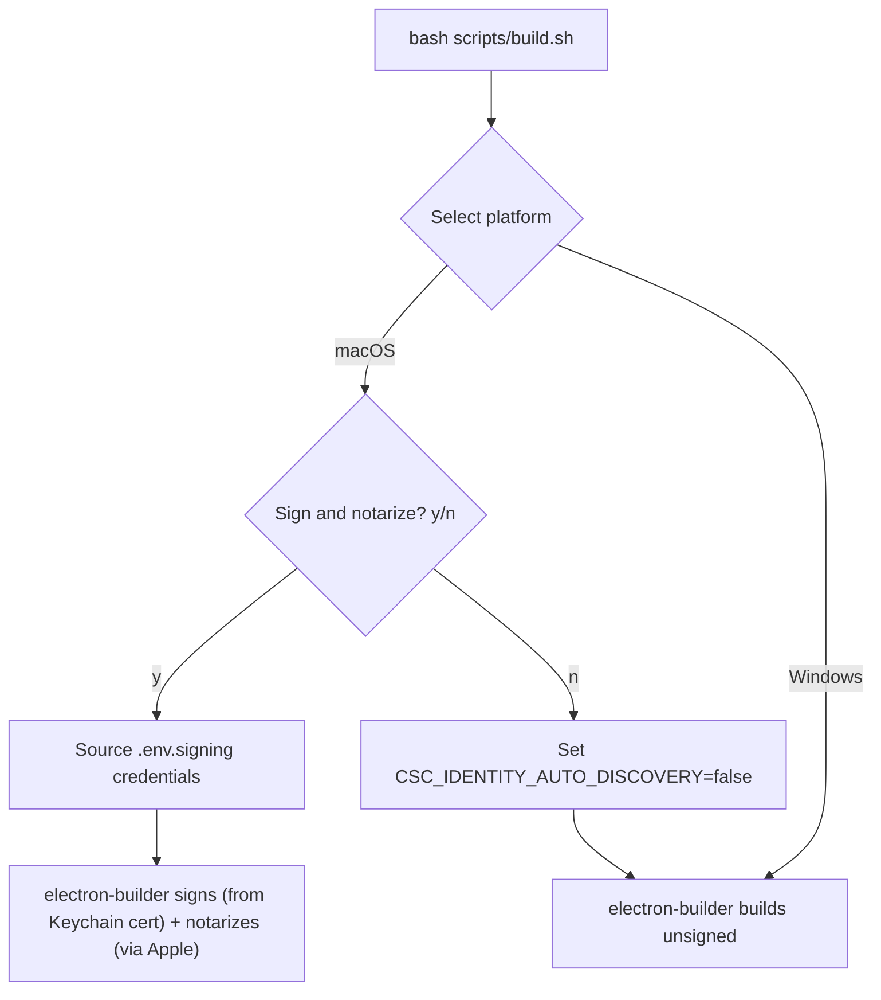

# macOS Code Signing and Notarization

## How It Will Work




---

## Prerequisites (Manual Steps - Instructions Below)

### 1. Install your Developer ID Application certificate in Keychain

- Open **Keychain Access** on your Mac
- If you have a `.p12` file: File > Import Items, select the file, enter its password
- If you generated it via Xcode or Apple Developer portal, it may already be in your Keychain
- Verify it's there: run `security find-identity -v -p codesigning` in Terminal -- you should see a line like `"Developer ID Application: Your Name (TEAMID)"`

### 2. Create `.env.signing` file (gitignored, local credentials)

Create a file at the project root called `.env.signing` with:

```bash
export APPLE_ID="your-apple-id@email.com"
export APPLE_APP_SPECIFIC_PASSWORD="xxxx-xxxx-xxxx-xxxx"
export APPLE_TEAM_ID="YOUR_TEAM_ID"
```

- `APPLE_ID`: your Apple Developer account email
- `APPLE_APP_SPECIFIC_PASSWORD`: generated at appleid.apple.com > Sign-In and Security > App-Specific Passwords
- `APPLE_TEAM_ID`: found at developer.apple.com > Membership Details (10-character alphanumeric)

### 3. Export certificate as base64 for CI

This is needed for GitHub Actions (which doesn't have your Keychain):

```bash
# Export from Keychain as .p12 (set a strong password when prompted)
security export -t identities -f pkcs12 -o hostbuddy-cert.p12

# Base64-encode it
base64 -i hostbuddy-cert.p12 | pbcopy
```

Then add these **GitHub repository secrets** (Settings > Secrets and variables > Actions):

- `CSC_LINK` -- paste the base64 string from clipboard
- `CSC_KEY_PASSWORD` -- the password you set during export
- `APPLE_ID` -- your Apple ID email
- `APPLE_APP_SPECIFIC_PASSWORD` -- the app-specific password
- `APPLE_TEAM_ID` -- your team ID

---

## Code Changes

### 1. Add `.env.signing` to `.gitignore`

Append `.env.signing` to `[.gitignore](.gitignore)` to prevent credentials from being committed.

### 2. Update `package.json` build.mac section

In `[package.json](package.json)`, change the `build.mac` section:

- Remove `"identity": null` -- let electron-builder auto-detect from Keychain (or `CSC_LINK` in CI)
- Set `"hardenedRuntime": true` -- required for notarization
- Set `"gatekeeperAssess": false` -- keep false (avoids issues on CI where spctl may not work)
- Add `"notarize": { "teamId": "YOUR_TEAM_ID" }` -- triggers built-in notarization in electron-builder 24.13+ when `APPLE_ID` and `APPLE_APP_SPECIFIC_PASSWORD` env vars are present; silently skips when they're absent

The `entitlements.mac.plist` is already correct and doesn't need changes.

### 3. Update `scripts/build.sh` -- add notarization prompt

After the platform selection and before running builds, if any macOS build was selected:

- Prompt: `Sign and notarize macOS build? (y/n):`
- If **y**: source `.env.signing` (if it exists, error if not), and let electron-builder pick up the Keychain cert and notarize env vars
- If **n**: export `CSC_IDENTITY_AUTO_DISCOVERY=false` to skip signing entirely (current behavior)

### 4. Update `scripts/notarize.js`

Replace the stub with a note that notarization is handled by electron-builder's built-in `notarize` config. Or simply delete the file since it's unused -- the `afterSign` hook is not referenced in `package.json`, so the stub was never wired up.

### 5. Update `.github/workflows/build.yml` -- macOS job

Update the `[build.yml](.github/workflows/build.yml)` macOS job:

- Remove `CSC_IDENTITY_AUTO_DISCOVERY: false`
- Add the signing/notarization secrets as env vars on the build step:

```yaml
  env:
    CSC_LINK: ${{ secrets.CSC_LINK }}
    CSC_KEY_PASSWORD: ${{ secrets.CSC_KEY_PASSWORD }}
    APPLE_ID: ${{ secrets.APPLE_ID }}
    APPLE_APP_SPECIFIC_PASSWORD: ${{ secrets.APPLE_APP_SPECIFIC_PASSWORD }}
    APPLE_TEAM_ID: ${{ secrets.APPLE_TEAM_ID }}
  

```

- The Windows job stays unchanged (no signing)

---

## What Changes at Build Time

- **Local unsigned build**: same as today -- select macOS, say "n" to notarize
- **Local signed + notarized build**: select macOS, say "y", takes ~2-10 extra minutes while Apple's servers verify
- **CI build**: always signs and notarizes (secrets are present), takes longer but fully automated
- **Windows builds**: completely unaffected

