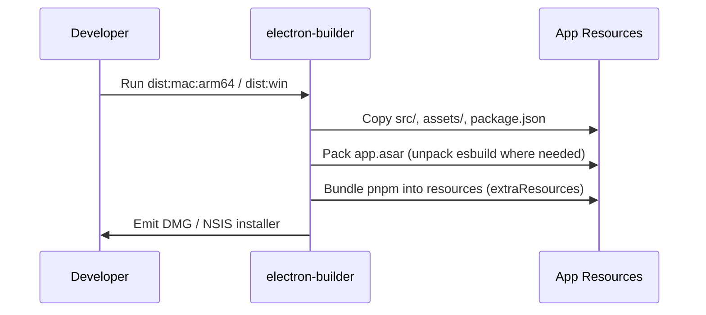

# HostBuddy: Initial Release and Technical Overview (2025)

The first public release of HostBuddy, the desktop runtime I built to safely run small, single‑file apps generated by AI or hand‑authored as either HTML or React. This article outlines purpose, architecture, technologies, packaging for distribution, and the lessons I learnt while shipping v0.1.0.

## Why I built HostBuddy

- **Frictionless local execution**: I often prototype small interfaces that don’t need a server. I wanted a trustworthy host that opens instantly and runs client‑only code safely.
- **AI workflow friendly**: Most AI outputs are either a block of HTML or a single React component. HostBuddy accepts both, scans imports, installs small client libraries with safeguards, and runs the app.
- **Offline optionality**: For repeat use, I can opt‑in to persistent, offline‑capable dependencies for a given project.

## Core proposition

- **Project manager UI** for creating, editing, and running small apps.
- **Two modes**:
  - HTML (self‑contained, inline CSS/JS)
  - React (single component with a default export; TypeScript or JavaScript)
- **Secure defaults**: Node integration disabled, context isolation enabled, sandboxed renderer windows.

## Technologies used

- **Electron 30** for cross‑platform desktop runtime.
- **Electron Builder** for packaging (DMG on macOS, NSIS on Windows).
- **esbuild** for fast React bundling at run‑time.
- **Bundled pnpm** for client‑side dependency installs with safeguards (no lifecycle scripts, optional dependencies disabled, modest size caps).
- **Twind** for light, on‑demand Tailwind‑compatible styling in React mode when desired.
- **Jest** for unit tests of the project store.

## High‑level architecture

- **Main process** (`src/main`)
  - `main.js`: Creates the primary window, configures security, initialises IPC.
  - `ipc.js`: Implements commands for listing/creating/updating/deleting projects and running them.
  - `projectsStore.js`: File‑backed store for persistent projects under the user data directory.
- **Preload** (`src/preload.js`)
  - Exposes a small, explicit API into the renderer using `contextBridge` and `ipcRenderer`.
- **Renderer** (`src/renderer`)
  - `index.html`, `renderer.js`, `styles.css`: The UI for managing projects.
- **Assets** (`assets/`)
  - Default app image and icons for packaging.
- **Build resources** (`build/`)
  - `icon.icns` (macOS), `icon.ico` (Windows) for native installers.

### Sequence: running a project (React path)

```mermaid
sequenceDiagram
    actor User
    participant UI as Renderer (UI)
    participant Preload as Preload (contextBridge)
    participant Main as Main (IPC + Store)
    participant Runner as Runner Window
    participant Bundler as esbuild
    participant PkgMgr as Bundled pnpm

    User->>UI: Click “Run”
    UI->>Preload: api.runProject(id)
    Preload->>Main: ipc invoke projects:run(id)
    Main->>Main: Load project from ProjectsStore
    alt Code detected as React
        Main->>Runner: Create BrowserWindow (isolated)
        Main->>Main: Prepare temp/persistent run dir
        Main->>PkgMgr: pnpm install (prod, ignore-scripts, no optional)
        Note over Main,PkgMgr: Adds missing safe packages discovered from imports
        Main->>Bundler: esbuild bundle index.tsx → bundle.js
        Main->>Runner: loadFile(index.html)
    else HTML
        Main->>Runner: loadURL(data:text/html;…)
    end
    Runner->>User: App loads and runs client‑side
```

### IPC contract

- `projects:list`, `projects:create`, `projects:update`, `projects:delete`
- `projects:run`: orchestrates the React/HTML detection, optional install and bundling, then launches the app window

## Security stance

- `nodeIntegration: false`, `contextIsolation: true`, `sandbox: true` in BrowserWindow.
- Preload exposes a minimal API surface.
- Client‑only execution model: no servers, no environment variables, no Node APIs in user code.
- Dependency installation safeguards:
  - No lifecycle scripts (`--ignore-scripts`)
  - No optional dependencies (`--no-optional`)
  - Limited package count and size caps when auto‑augmenting dependencies.

## Packaging and distribution

- **Electron Builder** configuration in `package.json`:
  - macOS DMG with `build/icon.icns`
  - Windows NSIS with `build/icon.ico`
  - `asar: true`, with `asarUnpack` for `esbuild` binaries
  - `extraResources` bundles `node_modules/pnpm/dist` so the bundled CLI is available at runtime
- **Scripts**:
  - `dist:mac:arm64` for Apple Silicon; `dist:mac:x64` (Rosetta) for Intel builds
  - `dist:win` for Windows installers (run on Windows)
- **CI**: GitHub Actions workflow to build macOS arm64 and Windows installers and upload artifacts.

### Sequence: packaging flow



## Challenges encountered

- **Cross‑platform binaries (esbuild)**: esbuild distributes platform‑specific binaries as optional dependencies. A single `node_modules` cannot satisfy both macOS arm64 and x64. I solved this by providing separate scripts: native arm64 install for M‑series Macs and Rosetta‑based install for x64 builds.
- **Bundling a package manager**: I wanted dependency installs without requiring system npm/yarn. Bundling `pnpm` and running it via `ELECTRON_RUN_AS_NODE` worked well, with install flags to preserve safety.
- **Security by default**: Keeping the renderer sandboxed and APIs minimal required some discipline. The preload layer exposes only what’s needed.
- **Unsigned distribution friction**: Gatekeeper (macOS) and SmartScreen (Windows) will warn for unsigned builds. I documented the first‑run steps and left signing/notarisation as a follow‑up.

## What I learnt

- Keep the **runtime surface area tiny**. A small, explicit preload bridge is easier to reason about and secure.
- Invest in **developer ergonomics** early: a couple of reliable build scripts and CI artifacts remove ambiguity when packaging.
- Prefer **simple, safe defaults** over configuration sprawl. The app runs well with a narrow set of features done properly.
- When supporting React, **treat bundling as an implementation detail**: detect the code shape, scaffold minimally, install just what’s needed, then bundle.

## Roadmap thoughts

- Code signing and notarisation for smoother first‑run experience.
- Optional auto‑update channel.
- Export/share projects as single files.
- Additional safe UI primitives for rapid prototyping.

## Tags

- hostbuddy, electron, desktop runtime, esbuild, pnpm, sandboxed renderer, react, html, packaging, dmg, nsis, macos, windows, developer tools, ai workflows, local apps

---

If you’re curious about how it’s built or want to try it, see `INSTALLATION.md` for platform‑specific install steps and `BUILDING.md` if you’d like to build from source.
