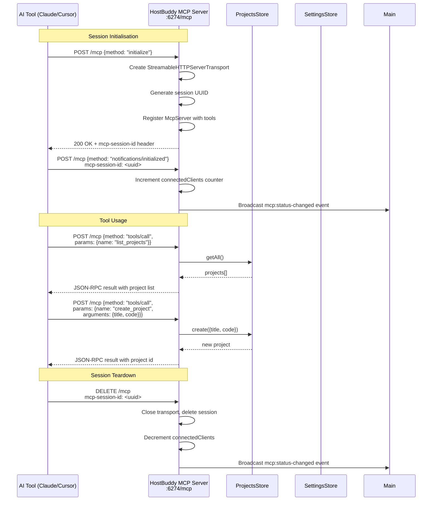
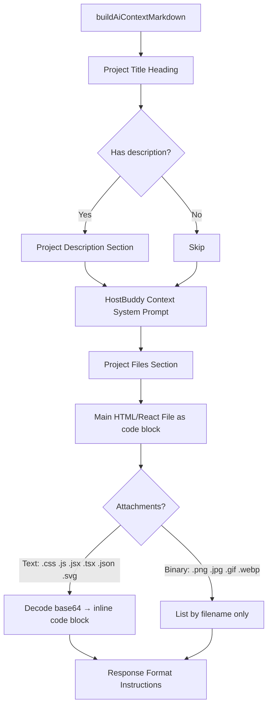
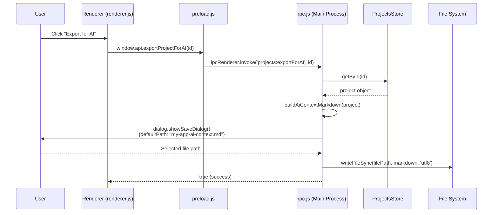
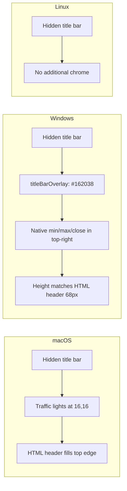
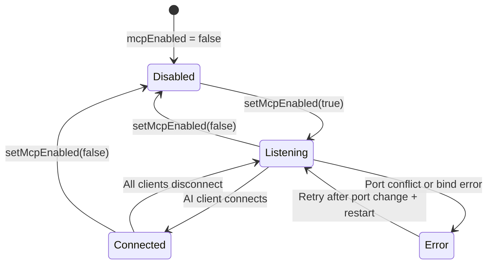

# HostBuddy v2.0: Building an MCP Server, AI Context Export, and a Platform-Aware UI

**Date:** May 2026  
**Version:** v2.0  
**Scope:** commits `470ef39` through `6e7c96b` (since `88b712a`)  
**Status:** Released

---

## Executive Summary

Following the architectural overhaul of project storage in v1.4.0, HostBuddy v2.0 turns its attention to the question of how the application should integrate with the broader AI ecosystem. The apps HostBuddy runs are themselves AI-generated — but updating or extending them requires the user to manually copy code, paste it into an AI chat, explain the project context, and then paste the result back. That friction felt wrong for a tool designed around AI-generated software.

This phase of development introduces three interconnected capabilities:

1. **A local Model Context Protocol (MCP) server** — so that AI coding tools such as Claude Code, Cursor, and Codex can directly list, read, create, and update HostBuddy projects without any copy-pasting.
2. **An AI context export feature** — a one-click way to generate a structured Markdown document containing a project's full code, attachments, and context constraints, ready to paste into any AI assistant.
3. **A significantly improved application shell** — platform-aware native title bar chrome, a reorganised toolbar with a split-button and overflow menu, a live MCP status indicator, and improved project card picture management.

What this release represents is a meaningful step-change: HostBuddy v2.0 is no longer just a runtime for AI apps — it is now an MCP-capable host that AI tools can integrate with directly.

---

## Table of Contents

1. [What Changed](#what-changed)
2. [The Model Context Protocol Server](#the-model-context-protocol-server)
3. [The AI Context Builder](#the-ai-context-builder)
4. [Export for AI — Markdown Context Files](#export-for-ai--markdown-context-files)
5. [MCP Settings and Persistence](#mcp-settings-and-persistence)
6. [Project Picture Modes and `useAppScreenshot`](#project-picture-modes-and-useappscreenshot)
7. [Platform-Aware Title Bar and Window Chrome](#platform-aware-title-bar-and-window-chrome)
8. [Toolbar Reorganisation — Split-Button and Overflow Menu](#toolbar-reorganisation--split-button-and-overflow-menu)
9. [MCP Status Indicator in the Header](#mcp-status-indicator-in-the-header)
10. [Getting Started Modal — MCP Server Tab](#getting-started-modal--mcp-server-tab)
11. [Global Modal Management](#global-modal-management)
12. [Card Entrance Animations](#card-entrance-animations)
13. [Test Coverage](#test-coverage)
14. [Technologies Used](#technologies-used)
15. [Challenges Encountered](#challenges-encountered)
16. [What I Learnt](#what-i-learnt)
17. [Future Considerations](#future-considerations)
18. [Tags](#tags)

---

## What Changed

The following files were created or significantly modified since commit `88b712a`:

| File | Status | Summary |
|------|--------|---------|
| `src/main/mcpServer.js` | **New** | Full MCP server implementation using Express and the official MCP SDK |
| `src/main/aiContext.js` | **New** | AI context prompt constant and `buildAiContextMarkdown()` utility |
| `src/main/ipc.js` | **Updated** | `exportForAI`, `mcp:getStatus`, `mcp:setEnabled`, `mcp:setPort`, `settings:getMcpSettings` handlers |
| `src/main/main.js` | **Updated** | MCP server lifecycle integration, hidden title bar, platform-specific chrome |
| `src/main/settingsStore.js` | **Updated** | `getMcpEnabled`, `setMcpEnabled`, `getMcpPort`, `setMcpPort` methods |
| `src/main/projectsStore.js` | **Updated** | `useAppScreenshot` field across create, update, and listing |
| `src/preload.js` | **Updated** | Exposes MCP APIs and `platform` to the renderer via `contextBridge` |
| `src/renderer/renderer.js` | **Heavily updated** | MCP status display, picture mode logic, dropdown menus, modal management |
| `src/renderer/index.html` | **Heavily updated** | Split-button, MCP pill, overflow menu, picture radio group, MCP tab in Getting Started |
| `src/renderer/styles.css` | **Updated** | Styles for all new UI components |
| `tests/mcpServer.test.js` | **New** | Integration tests for all seven MCP tools and HTTP transport |
| `tests/buildAiContext.test.js` | **New** | Unit tests for the AI context markdown builder |

---

## The Model Context Protocol Server

This is the centrepiece of this development phase. I built a local HTTP server that implements the [Model Context Protocol (MCP)](https://modelcontextprotocol.io/) — an open standard that allows AI tools to discover and call external capabilities in a structured, typed way.

### What It Does

The HostBuddy MCP server runs on `127.0.0.1:6274` by default and exposes seven tools and one resource:

**Tools:**

| Tool | Description |
|------|-------------|
| `get_documentation` | Returns the full HostBuddy AI context: code format rules, architecture constraints, supported features |
| `list_projects` | Lists all projects with id, title, description, and creation date |
| `get_project` | Returns full project details including code and attachment metadata |
| `get_project_for_ai` | Returns a project formatted as a complete AI context Markdown document |
| `create_project` | Creates a new project from a title and code string |
| `update_project` | Updates one or more fields of an existing project |
| `delete_project` | Permanently deletes a project |

**Resources:**

| Resource URI | Description |
|--------------|-------------|
| `hostbuddy://docs/context` | The HostBuddy AI context document as a readable MCP resource |

### How It Works

The server is implemented in `src/main/mcpServer.js` using:
- **`express`** (v5) as the HTTP framework
- **`@modelcontextprotocol/sdk`** for the `McpServer`, `StreamableHTTPServerTransport`, and protocol helpers
- **`zod`** (v4) for tool input schema validation
- **`node:crypto`** for session UUID generation

The transport used is **Streamable HTTP**, which is the modern MCP transport that supports both request/response and server-sent events within the same HTTP connection. Each new AI client connection creates a session identified by a UUID, tracked in a `_sessions` map.



### Lifecycle — Running as a Service

One of the more interesting aspects of this implementation is that the MCP server runs for the entire lifetime of the Electron application. It starts in `main.js` immediately after the window is ready and the IPC handlers are initialised:

```javascript
// src/main/main.js
mcpServer.onStatusChange((status) => {
  if (mainWindow && !mainWindow.isDestroyed()) {
    mainWindow.webContents.send('mcp:status-changed', status);
  }
});
mcpServer.start(projectsStore, settingsStore);
```

The server module exposes four functions: `start()`, `stop()`, `getStatus()`, and `onStatusChange()`. Status changes — such as a new client connecting or disconnecting — are pushed to the renderer via IPC, keeping the UI live indicator in sync without polling.

The server binds exclusively to `127.0.0.1` (localhost), meaning it is not accessible from outside the machine. This is an intentional security boundary: AI tools running on the same machine can connect, but the server is not exposed to the network.

### Session Management

A notable design decision is the per-session McpServer pattern. Each time a new AI client initialises (sends the `initialize` request without a session ID), the server creates a fresh `McpServer` instance and binds it to a new `StreamableHTTPServerTransport`. The transport's `onclose` callback handles decrement of the connected client count and cleans up the session entry.

This approach means each client gets its own isolated server instance, which aligns well with MCP's stateless-per-session model and avoids any shared mutable state between concurrent AI tool connections.

---

## The AI Context Builder

`src/main/aiContext.js` is a small but important module that serves two purposes:

1. **`HOSTBUDDY_AI_CONTEXT`** — a constant string containing the full system prompt that describes what HostBuddy is, what code formats it accepts, what architecture constraints exist, and how attachments work. This is returned verbatim by the `get_documentation` MCP tool and prepended into every exported AI context document.

2. **`buildAiContextMarkdown(project)`** — a function that takes a project object and returns a structured Markdown document suitable for pasting directly into any AI assistant (ChatGPT, Claude, Gemini, etc.).

### What the Context Document Contains



The key intelligence in `buildAiContextMarkdown()` is how it handles attachments. Text-based files (CSS, JavaScript, JSON, SVG) are decoded from their base64 data URI representation and included in full as syntax-highlighted code blocks. Binary files (images) are listed by filename only, since including their binary content in a chat context would be both wasteful and unsupported by most AI interfaces.

The system prompt included in every document explicitly tells the AI:
- To output **complete** code, not diffs or partials
- That references to attached filenames are resolved at runtime by HostBuddy (so `` is correct)
- That no external URLs or CDN links should be used
- That the format (HTML or React) must be preserved

---

## Export for AI — Markdown Context Files

Before this work, HostBuddy had an inline "Update Request Modal" — a built-in UI where the user typed their development request, HostBuddy generated a prompt by concatenating the project code with a static system prompt, and the user could copy that prompt to the clipboard.

That approach had two problems. First, the context prompt was baked into the renderer JavaScript, meaning it diverged from any improvements made in `aiContext.js`. Second, it was tightly coupled to a specific workflow (type request here, copy, paste to AI, paste result back), which does not accommodate the varied ways people actually use AI assistants.

The replacement is simpler and more flexible: a single **"Export for AI"** button in the project edit modal that triggers a native Save File dialogue and writes the `buildAiContextMarkdown()` output to a `.md` file on disk. The user can then attach that file to any AI conversation, use it as context for an AI coding agent, or feed it to an API.



The IPC handler for `projects:exportForAI` was added to `ipc.js` alongside a corresponding `exportProjectForAI` entry in `preload.js`. The handler slugifies the project title for the default filename, making the saved file immediately identifiable.

The old "Update Request Modal" code — roughly 130 lines of JavaScript in `renderer.js` and the corresponding HTML — was removed entirely. The inline `UPDATE_REQUEST_CONTEXT` string constant in the renderer was also removed, as its canonical home is now `aiContext.js`.

---

## MCP Settings and Persistence

Two new methods were added to `settingsStore.js`:

- `getMcpEnabled()` / `setMcpEnabled(bool)` — whether the MCP server should start on launch. Defaults to `true`.
- `getMcpPort()` / `setMcpPort(number)` — the port to listen on. Defaults to `6274`. Validated to the range 1024–65535.

These settings are persisted in the existing `settings.json` file managed by `SettingsStore`, alongside the `projectsDir` setting introduced in v1.4.0. The default-enabled behaviour means that for most users, the MCP server simply starts when HostBuddy opens — no configuration required.

Three new IPC handlers surface these settings to the renderer:

| IPC Channel | Action |
|-------------|--------|
| `mcp:getStatus` | Returns current enabled state, port, connected client count, and any error |
| `mcp:setEnabled` | Enables or disables the server (starting or stopping it immediately) |
| `mcp:setPort` | Saves the port number (requires a restart to take effect) |
| `settings:getMcpSettings` | Returns `{enabled, port}` — used on settings modal open |

---

## Project Picture Modes and `useAppScreenshot`

Previously, a project's card image was determined by a simple priority chain: thumbnail (captured after run) → custom icon → default placeholder. If a user uploaded a custom icon, it would persist even after the app had been run and a thumbnail was available.

This update formalises the choice into three explicit **picture modes**, selected via radio buttons in the project create/edit modal:

| Mode | Behaviour |
|------|-----------|
| **Default** | Uses the HostBuddy placeholder icon |
| **App Screenshot** | Uses the thumbnail captured after the project was last run |
| **Custom** | Uses an uploaded image file |

The selected mode is stored as a `useAppScreenshot` boolean on the project (future work could expand this to a named enum). When `useAppScreenshot` is true and a `thumbnailBase64` is present, the card renders the screenshot. If no thumbnail has been captured yet (the app has never been run), the card falls back to the default icon until a screenshot is available.

The `useAppScreenshot` field was added to `projectsStore.js` across the `create()`, `update()`, `getAll()` summary, and `getById()` full-read code paths, as well as to the `manifest.json` written inside each `.hbproject` ZIP.

The picture mode is also restored correctly when a project is reopened for editing — the modal reads the stored `useAppScreenshot` and `iconBase64` values and pre-selects the appropriate radio button.

---

## Platform-Aware Title Bar and Window Chrome

One of the smaller but visually impactful changes is the adoption of a custom title bar across both macOS and Windows. Previously, HostBuddy used the OS-default title bar, which produced an inconsistent appearance — the app had a branded header area built in HTML/CSS, but the native title bar sat above it.

In `main.js`, the `BrowserWindow` is now created with `titleBarStyle: 'hidden'`, which removes the native title bar entirely and allows the HTML content to extend into that space. The window size was also increased from 1100×800 to 1210×880 to better accommodate the richer UI.

Platform-specific adjustments are applied conditionally:

```javascript
// macOS: position traffic light buttons (close/minimise/zoom)
// with consistent 16px padding from top-left
...(isMac && { trafficLightPosition: { x: 16, y: 16 } }),

// Windows: overlay native caption buttons (min/max/close) in top-right,
// coloured to match the dark header (#162038)
...(isWin && { titleBarOverlay: {
  color: '#162038',
  symbolColor: '#e5e7eb',
  height: HEADER_HEIGHT   // 68px — matches HTML header
}}),
```

The `HEADER_HEIGHT` constant of 68px is calculated as the icon height (36px) plus top and bottom padding (16px each). This ensures the Windows caption buttons align precisely with the header row.

Platform detection is also exposed to the renderer via `preload.js` as `window.api.platform`, allowing the renderer to apply conditional styles — for example, adding left padding on macOS to avoid the traffic light buttons overlapping content.



---

## Toolbar Reorganisation — Split-Button and Overflow Menu

The main toolbar previously contained a row of individually visible buttons: New, Import, Feedback, Getting Started, Edit, Settings. As the feature set grew this became visually cluttered.

This update reorganises the toolbar into:

**Left side:**
- A **split-button** for "New Project" — the primary button creates a project directly, while a **caret (▼)** button opens a dropdown containing the Import option.

**Right side:**
- The **MCP status pill** (discussed below)
- An **overflow (⋮) menu** containing: Settings, Getting Started, Feedback

The dropdown behaviour is implemented with a pair of helper functions (`openDropdown`, `closeDropdown`, `toggleDropdown`) in `renderer.js`. Both dropdown menus close when:
- The other dropdown is opened
- The user clicks anywhere outside the menu
- The user presses `Escape`

The `aria-haspopup` and `aria-expanded` attributes are set correctly on the trigger buttons for assistive technology compatibility.

The **Edit toggle** was changed from a stateful text button (alternating "Edit" / "Done") to a native `<input type="checkbox">` element, which simplifies the change handler — the listener now reads `btnToggleEdit.checked` directly rather than inferring state from the button label.

---

## MCP Status Indicator in the Header

A compact status pill sits in the header between the split-button and the overflow menu. It shows a coloured dot and the label "MCP", giving the user a constant, non-intrusive indication of whether the MCP server is running and whether any AI tools are connected.

The dot has four states:

| State | Dot Colour | Condition |
|-------|-----------|-----------|
| Disabled | No colour (grey) | MCP server is turned off |
| Listening | Amber/yellow | Server running, no clients connected |
| Connected | Green | One or more AI clients connected |
| Error | Red | Server failed to start (e.g., port in use) |



Status updates flow from the MCP server module through the main process to the renderer via the `mcp:status-changed` IPC event, which the renderer listens to with `window.api.onMcpStatusChanged`. This means the dot updates in real time as clients connect and disconnect, without the renderer needing to poll.

Clicking the status pill opens the Settings modal, taking the user directly to the MCP configuration section.

---

## Getting Started Modal — MCP Server Tab

The Getting Started modal already existed as an onboarding guide covering project creation, the `.hbproject` format, and the copy-AI-context workflow. A new **"MCP Server"** tab was added, covering:

- What the MCP server is and how it differs from the manual copy-paste workflow
- The live server status banner (same dot + descriptive text shown in the header)
- The server URL (`http://localhost:6274/mcp`) with a copy button
- Step-by-step configuration instructions for:
  - **Claude Desktop** — `claude_desktop_config.json` using `npx mcp-remote` as a stdio-to-HTTP bridge (Claude Desktop does not support URL-based MCP servers natively)
  - **Claude Code** — `claude mcp add --transport http hostbuddy http://localhost:6274/mcp`
  - **Cursor** — adding an entry to `.cursor/mcp.json`
  - **Any MCP-compatible tool** — generic URL for tools supporting Streamable HTTP
- A table of available MCP tools with their descriptions
- Troubleshooting notes (port conflicts, HostBuddy must be running)

When the Getting Started modal opens, `_refreshMcpStatus()` is called immediately so the live status banner reflects the current state.

---

## Global Modal Management

Before this update, each modal had its own bespoke close logic — some closed via dedicated cancel buttons, some via a specific "close" handler. There was no consistent way to close modals by clicking outside them or pressing Escape.

A unified modal management layer was added to `renderer.js`:

```javascript
function dismissModal(modalEl) {
  if (!modalEl || modalEl.classList.contains('hidden')) return;
  if (modalEl === modal) { hideModal(); return; }
  if (modalEl === gsModal) { closeGettingStarted(); return; }
  if (modalEl === folderModal) { closeFolderModal(); return; }
  if (modalEl === settingsModal) { settingsModal.classList.add('hidden'); return; }
  modalEl.classList.add('hidden');
}
```

Two global event listeners on `document` handle:
- **`data-dismiss="modal"` attribute** — any element with this attribute closes the nearest ancestor `.modal`
- **Backdrop click** — clicking a `.modal` element directly (i.e., the dark overlay, not its child panel) dismisses it
- **Escape key** — finds the first non-hidden `.modal` in the DOM and dismisses it

This approach is deliberately simple: no component hierarchy, no state management library, just DOM queries. It works consistently across all modals in the app.

---

## Card Entrance Animations

A subtle but polished addition: project cards now animate in with a staggered fade-up effect when the project grid is populated or refreshed.

Each card receives a CSS custom property `--card-index` equal to its position in the list. A CSS animation uses this value to stagger the delay:

```css
/* Each card's delay is based on its index */
animation-delay: calc(var(--card-index) * 40ms);
```

Before replacing the grid's contents on a data refresh, the existing cards are faded out first by adding a `grid--exiting` class and waiting 150ms. This prevents the jarring "flash" that occurred when the grid was cleared and repopulated instantly.

---

## Test Coverage

Two new test files were written to cover the new functionality.

### `tests/buildAiContext.test.js`

Eight unit tests covering `buildAiContextMarkdown()`:

- Includes project title and main code
- Includes description when present, omits it when absent
- Includes the HostBuddy context constraints section
- Decodes and inlines text-based attachments (CSS, JS) from base64
- Lists binary attachments (images) by filename only, without decoding
- Handles projects with no attachments
- Uses the correct fenced code block language for each file type
- Includes the response format instructions section

### `tests/mcpServer.test.js`

Integration tests that spin up the real MCP server on a test port (`16274`) and exercise it via actual HTTP requests:

- Initialises an MCP session and validates the session ID header
- Calls `list_projects` on an empty store
- Calls `create_project` and verifies the returned id and title
- Calls `get_project` to retrieve the created project
- Calls `get_project_for_ai` and verifies the markdown structure
- Calls `update_project` and verifies the title change
- Calls `delete_project` and confirms the project is gone
- Calls `get_documentation` and verifies the context constant is returned

The tests use raw Node.js `http.request` rather than a fetch library, keeping the test runner dependency-free for the network layer. SSE-format responses are parsed by splitting on `data:` lines and JSON-parsing each chunk.

---

## Technologies Used

| Technology | Version | Role |
|-----------|---------|------|
| **Electron** | Existing | Desktop application shell, IPC, BrowserWindow |
| **Node.js** | Existing | Main process runtime |
| **Express** | v5.2.1 | HTTP server for the MCP endpoint |
| **`@modelcontextprotocol/sdk`** | v1.29.0 | McpServer, StreamableHTTPServerTransport, protocol types |
| **Zod** | v4.4.3 | Input schema validation for MCP tool arguments |
| **`node:crypto`** | Built-in | UUID generation for MCP session IDs |
| **Jest** | Existing | Test runner for unit and integration tests |
| **adm-zip** | Existing (v1.4.0) | `.hbproject` ZIP read/write (unchanged) |

The MCP SDK is the most significant new dependency. It handles the JSON-RPC 2.0 message framing, the Streamable HTTP transport protocol, and the tool/resource registration API. Without it, implementing MCP from scratch would have required handling the session handshake, SSE framing, protocol versioning, and capability negotiation manually.

---

## Challenges Encountered

### 1. Understanding MCP Transport Options

The Model Context Protocol supports several transports: `stdio` (for local CLI tools), `SSE` (an older HTTP push approach), and **Streamable HTTP** (the modern standard). Initial reading of the MCP documentation was confusing because older integrations (including many examples online) use SSE, but the SDK's preferred path is now Streamable HTTP.

Getting the session initialisation flow correct — where a POST without a session ID must be treated as an `initialize` request, and subsequent POSTs route to the existing session transport — required careful reading of the SDK source and the MCP spec.

### 2. Session Lifecycle and Connected Client Count

Tracking connected clients correctly proved tricky. The `onsessioninitialized` callback fires when a session is first set up, but session teardown can happen in multiple ways: the client sends a DELETE request, the transport `onclose` event fires, or the client simply disconnects. Without careful handling, the count could desynchronise.

The solution was to trust `transport.onclose` as the canonical teardown event and guard the decrement with `Math.max(0, _connectedClients - 1)` to prevent it going negative under unexpected conditions.

### 3. Platform Title Bar Height Alignment

Getting the Windows `titleBarOverlay` height to exactly match the HTML header was more fiddly than expected. The height value must account for the full rendered height of the header element — icon size, padding above, and padding below. Setting it to the wrong value caused the native caption buttons to overlap content or leave a gap between the overlay and the header.

The solution was to define a `HEADER_HEIGHT` constant in `main.js` with an explanatory comment (`icon 36px + top padding 16px + bottom padding 16px = 68px`), making future adjustments obvious.

### 4. Removing the Old Update Request Modal Cleanly

The original "Update Request Modal" was spread across approximately 130 lines of JavaScript in `renderer.js` — the open/close functions, a large inline `UPDATE_REQUEST_CONTEXT` string constant, the prompt-building function, and three button event listeners. Removing it without breaking adjacent code required careful identification of all references.

The replacement (the `exportProjectForAI` button handler) is around 10 lines, because the heavy lifting moved to `aiContext.js` and `ipc.js`. The overall line count of `renderer.js` decreased despite the addition of new functionality.

### 5. Dropdown Mutual Exclusion

The split-button caret dropdown and the overflow menu both needed to close when the other was opened, and both needed to close on outside click. A naïve implementation risks double-firing events (a click inside a dropdown triggers both the dropdown's listener and the document's outside-click handler). The solution was to call `e.stopPropagation()` on the trigger buttons, preventing the document listener from seeing the click that opened the menu.

---

## What I Learnt

**The Model Context Protocol is more approachable than it appears.** The spec documentation is dense, but the official TypeScript SDK handles the majority of the complexity. Once I understood that Streamable HTTP is simply a POST endpoint that can return either a JSON response or an SSE stream depending on the Content-Type negotiation, the implementation became straightforward.

**Running a persistent HTTP server inside an Electron app is viable and practical.** There were no significant conflicts between Electron's event loop and Express. The server binds in the `app.whenReady()` phase, well after the Node.js event loop is fully established. The key requirement is binding to `127.0.0.1` rather than `0.0.0.0` to avoid exposing the service on the network.

**Custom Electron title bars are not just cosmetic.** Removing the native title bar and replacing it with an HTML header has real UX consequences: the `trafficLightPosition` on macOS needs careful coordination with the header layout, and on Windows the `titleBarOverlay` height must be an exact pixel match. Getting this wrong makes the app look unfinished.

**Replacing complex UI with a file system operation simplifies everything.** The original Update Request Modal tried to do too much inside the UI: build a prompt, display it, allow copying. The export-to-file approach is more versatile — the file can be attached to any AI tool, referenced later, version-controlled, or shared with a colleague.

**Test coverage for network services needs real HTTP, not mocks.** The MCP server tests use actual `http.request` calls against a server running on a test port. This catches real issues — incorrect headers, wrong HTTP status codes, malformed SSE framing — that mocks would not. The overhead is minimal because Express starts and stops in under 100ms.

---

## Future Considerations

- **Package version alignment** — the package version should be updated to `2.0.0` to reflect this release.
- **MCP `update_project` with attachment support** — the current `update_project` tool accepts code and text fields but not binary attachments. Extending it to support base64-encoded assets would allow AI tools to add images to projects programmatically.
- **Persistent MCP server across restarts** — currently the port change requires a HostBuddy restart. An in-process server restart (stop → update port → start) could apply the change immediately.
- **MCP authentication** — the server currently accepts connections from any process on localhost. Adding optional bearer token authentication would be appropriate if HostBuddy is ever used in a shared or multi-user environment.
- **`useAppScreenshot` as a named enum** — the `boolean` field works for now but storing the picture mode as a string (`'default' | 'screenshot' | 'custom'`) would be more readable and extensible.
- **Getting Started deep-linking** — the status pill currently opens the Settings modal. A more targeted UX would navigate directly to the MCP tab in Getting Started, with a secondary link to Settings for configuration.

---

## Tags

`electron` `mcp` `model-context-protocol` `express` `zod` `ai-integration` `localhost-server` `ipc` `contextbridge` `node-crypto` `uuid` `session-management` `streamable-http` `sse` `json-rpc` `ai-context` `markdown-export` `project-management` `hostbuddy` `desktop-app` `title-bar` `frameless-window` `traffic-lights` `windows-title-bar-overlay` `split-button` `dropdown-menu` `accessibility` `aria` `thumbnail` `screenshot` `picture-mode` `jest` `integration-testing` `http-testing` `uk-development`
