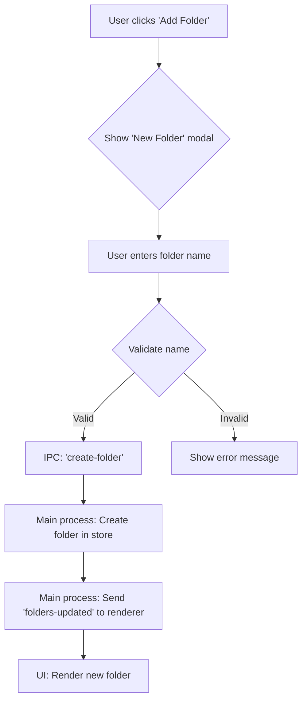
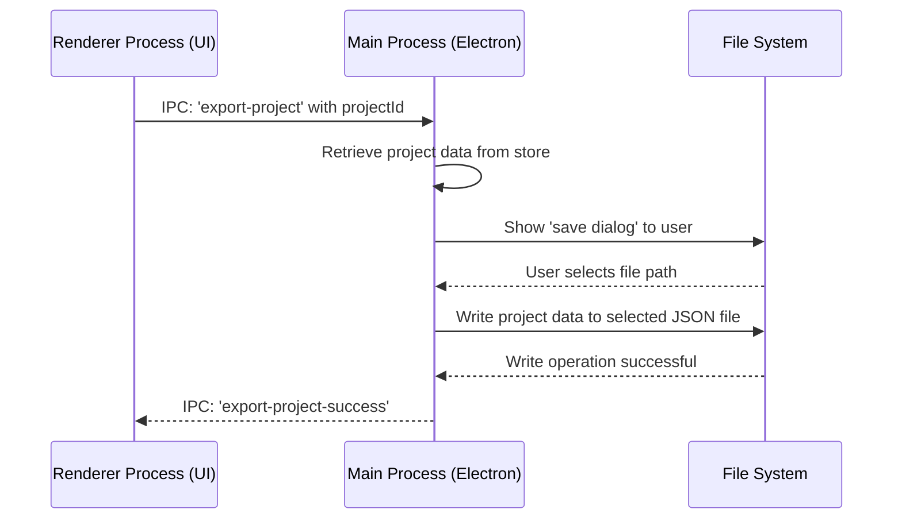

# HostBuddy v1.0: A Milestone Release Focused on Organisation and Portability

**Excerpt:** The journey to version 1.0 has been an exciting one, culminating in a release that significantly enhances project organisation and portability. This article reflects on the key features introduced since v0.1.1, including robust folder management, seamless project import/export, and a more intuitive user experience.

**Tags:** HostBuddy, v1.0, release notes, project management, folder management, import, export, electron, nodejs, javascript, UI, UX, accessibility

---

## Introduction

Reaching version 1.0 is a significant milestone for any project, and for HostBuddy, it represents a leap forward in our core mission: to provide a simple, yet powerful, local development project manager. The focus for this release has been squarely on improving workflow efficiency through better organisation and project portability. Since version 0.1.1, I have been working to introduce features that not only add new capabilities but also refine the existing user experience. This article delves into the key developments that have shaped this milestone release.

---

## A New Era of Organisation: Folder Management

One of the most requested features has been the ability to group and organise projects. With v1.0, I'm delighted to introduce a comprehensive folder management system.

Users can now:
- **Create and Rename Folders:** Easily create new folders to categorise projects and rename them as needs evolve.
- **Drag-and-Drop Functionality:** A simple and intuitive drag-and-drop interface allows for moving projects into folders, making organisation a seamless part of the workflow.

This new system is designed to be flexible, allowing users to structure their projects in a way that makes sense for them.

### How Folder Creation Works

Behind the scenes, the process of creating a folder involves a coordinated effort between the renderer process (the user interface) and the main process, which handles the application's logic and data storage.

---

## Project Portability: Seamless Import and Export

Another cornerstone of v1.0 is the introduction of project import and export functionality. This feature addresses the need to move projects between different machines or to simply back them up. An entire project configuration can now be exported to a single JSON file, which can then be imported into any HostBuddy instance.

### The Export Process

The export functionality is designed to be straightforward. When a user initiates an export, the application packages up all the necessary project data and saves it to a location of their choice.

---

## Refining the User Experience

Beyond the headline features, a significant amount of effort has gone into refining the user interface and overall user experience.

- **Revamped Project Creation Modal:** The process for creating a new project has been redesigned into a step-by-step wizard. This guided approach makes project setup more intuitive, especially for new users.
- **Enhanced UI and Accessibility:** I've replaced text-based buttons with clearer, icon-based ones for common actions like 'Run', 'Edit', 'Export', and 'Delete'. Each of these buttons now includes appropriate `aria-labels` and `titles` to ensure the application is more accessible to all users.

---

## Insightful Thoughts

The development of HostBuddy v1.0 has been a rewarding process, but it also raises several questions for the future:

- **Improving Drag-and-Drop:** How can the drag-and-drop experience be enhanced further? Are there complex scenarios or edge cases, such as moving multiple items at once, that should be considered?
- **Data Integrity:** With the new import/export functionality, what measures should be implemented to handle potential data corruption or version conflicts during import?
- **Sustaining Accessibility:** As the application continues to grow in complexity, what practices can be adopted to ensure a consistently high level of accessibility for all users?
- **Future Organisational Tools:** What other features, such as tagging or bulk actions, could further improve project organisation within HostBuddy?

The journey to v1.0 has laid a solid foundation. I'm excited to continue building upon it, and I look forward to seeing how these new features enhance the workflows of HostBuddy users.
