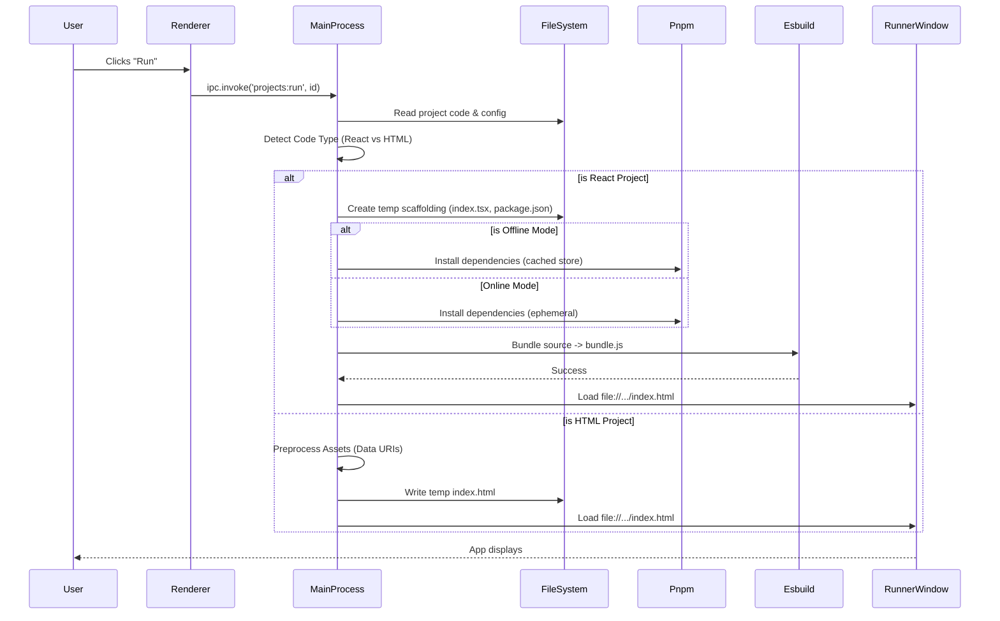

# Building HostBuddy: A Local Runtime for AI-Generated Apps (v1.2 Release)

## Introduction

I am thrilled to announce the v1.2 release of **HostBuddy**. Over the past few weeks, I have been working on a problem that has become increasingly common for developers and non-developers alike: bridging the gap between the code an AI writes and actually seeing that code run.

When you ask ChatGPT or Claude to "make a React app that calculates mortgage rates", you get a block of code. To run it, you usually need to set up a Node environment, initialise a Vite project, install dependencies, and start a server. HostBuddy eliminates this friction. It is a local "sandbox" that takes raw AI output—whether simple HTML or complex React components—and runs it instantly on your desktop, with no command line required.

This article details the technical journey to v1.2, the architecture behind our "compiler-in-a-box", and the lessons learned in building a secure, offline-capable runtime.

## Core Architecture: The "Compiler-in-a-Box"

HostBuddy is built on **Electron**, but unlike a standard web wrapper, it functions more like a lightweight IDE and build server combined.

### Tech Stack
*   **Electron:** For the cross-platform desktop shell.
*   **Vanilla JS (Renderer):** I opted for zero-dependency vanilla JavaScript for the UI management to keep the application startup instant and the codebase lean.
*   **Esbuild:** The heart of the React runtime. It allows us to bundle user code in milliseconds without a heavy Webpack setup.
*   **Pnpm:** Embedded directly into the app resource bundle to handle dependency resolution efficiently and support offline modes.
*   **Twind:** A runtime Tailwind CSS compiler, allowing users to use Tailwind classes in their AI-generated code without a build step.

### How It Works

When a user pastes code into HostBuddy, we don't just display it. We analyse it.

1.  **Detection:** We use regex heuristics to determine if the code is a raw HTML document or a React component (looking for `export default`, `import React`, etc.).
2.  **Scaffolding:** If it's React, we generate a temporary directory in the user's filesystem. We write a scaffold `index.html`, a `package.json`, and an entry point `index.tsx` that mounts their component.
3.  **Dependency Management:** We parse import statements to find npm packages.
4.  **Bundling:** We invoke a bundled binary of **esbuild** to compile the TypeScript/JSX into a single JavaScript bundle.
5.  **Execution:** We spin up a segregated `BrowserWindow` to load the result.

### Technical Implementation Flow

Here is the sequence of events when a user clicks "Run" on a React project:

## The "Offline" Challenge

One of the most complex features implemented in v1.0 was the **Offline Mode**. AI code often imports libraries like `lucide-react` or `recharts`. Relying on CDNs makes the app fragile and dependent on an internet connection.

To solve this, I embedded a stripped-down version of **pnpm** directly into the Electron resources. When a user toggles "Offline Mode", HostBuddy:

1.  Creates a persistent `node_modules` folder for that specific project.
2.  Invokes the embedded pnpm binary to download packages to a local global store within the app's user data directory.
3.  Links them to the project.

This allows a user to go onto a plane, open HostBuddy, and run a React application that relies on external libraries, with zero network access.

## Recent Updates: UX Polish & Workflow (v1.2)

In the final days leading to v1.2, I shifted focus from the backend runtime to the user experience.

### The "Getting Started" Overhaul
The initial onboarding was a wall of text. I realised that for a tool designed to simplify complexity, the manual was too complex.

I refactored the `Getting Started` dialog into a tabbed interface:
*   **Visual Workflow:** A graphical step-by-step guide (Get Code -> Create -> Run).
*   **Feature Grid:** Breaking down capabilities like folders and export options into digestible cards.
*   **AI Context Template:** We now provide a "Copy to Clipboard" prompt that users can feed to ChatGPT. This prompt "teaches" the AI about HostBuddy's constraints (no backend, local storage only), significantly improving the success rate of generated code.

### UI Refinements
*   **Responsive Modals:** Fixed layout issues where the "Create Folder" dialog was disproportionately large.
*   **Versioning:** Added a dynamic version badge (v1.2.0) that pulls directly from `package.json`, ensuring the UI always reflects the build version.

## Challenges & Lessons Learned

### 1. Sandboxing vs. Functionality
Electron security is a balancing act. We need to allow `esbuild` to write to the file system to bundle code, but we must prevent the *generated* app from having Node.js access.
*   *Solution:* We use `contextIsolation: true` and `sandbox: true` for the runner windows. The generated app runs purely as a web page, with no access to Electron APIs.

### 2. Asset Management
Users wanted to add images to their AI apps. Since we don't have a web server hosting these assets, simply referencing `` wouldn't work in a temp directory structure.
*   *Solution:* I implemented a pre-processor that takes attached files, converts them to **Base64 Data URIs**, and injects them into the HTML/CSS before runtime.

## Future Roadmap

With v1.2 released for Mac (Arm64) and Windows, the foundation is set. Future iterations will look at:
*   **TypeScript Support:** Allowing users to view and edit the generated TypeScript definitions.
*   **Multi-file Projects:** Breaking out of the "single file" constraint.
*   **Theme Editor:** A visual wrapper for the Twind configuration.

## Tags
`#Electron` `#React` `#AI` `#LocalRuntime` `#Esbuild` `#SoftwareArchitecture` `#OfflineFirst` `#OpenSource`
