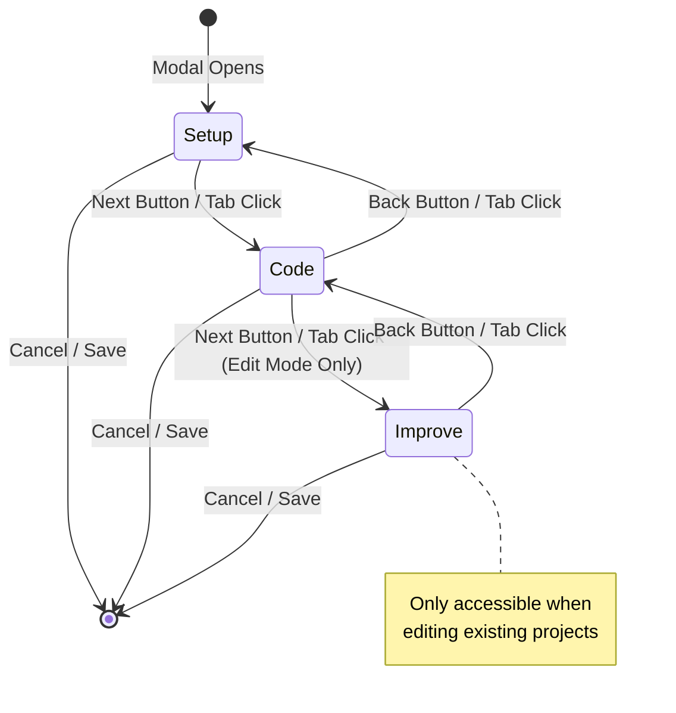
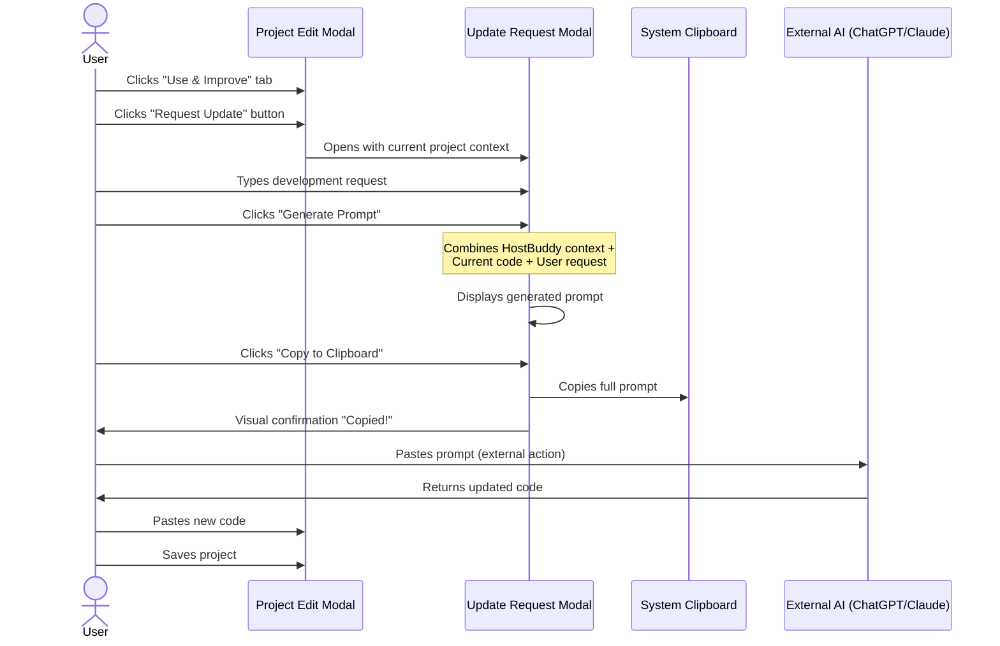
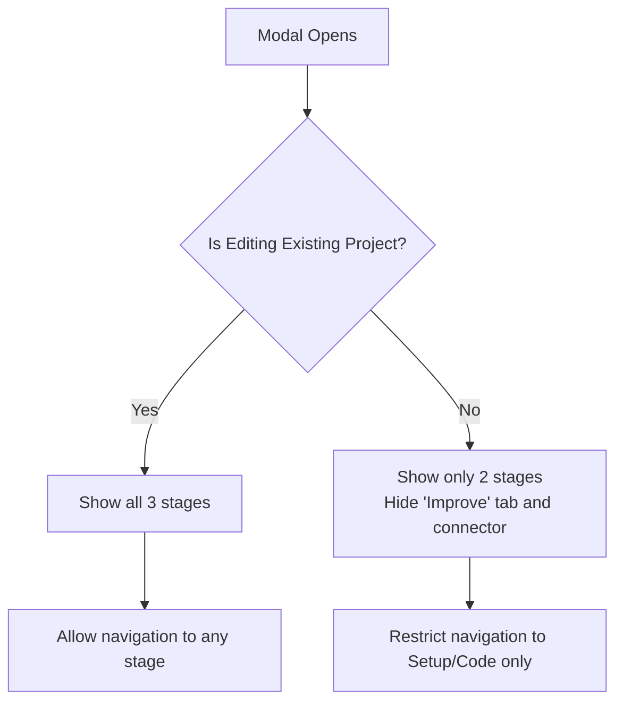

# HostBuddy v1.3.0: Stage Navigation and AI-Assisted Project Iteration

---

## Executive Summary

Following the v1.2.0 release, I have developed significant user experience improvements for HostBuddy, culminating in v1.3.0. This release introduces a **stage-based navigation system** for the project creation modal and a powerful new **"Request Update" feature** that streamlines the AI-assisted development workflow. These enhancements address a core friction point: users frequently need to iterate on their AI-generated applications, and the previous workflow made this cumbersome.

This article documents the technical implementation, architectural decisions, challenges encountered, and lessons learnt during this development cycle.

---

## Table of Contents

1. [Problem Statement](#problem-statement)
2. [New Features Overview](#new-features-overview)
3. [Technical Architecture](#technical-architecture)
4. [Implementation Details](#implementation-details)
5. [Build Configuration Enhancements](#build-configuration-enhancements)
6. [Challenges Encountered](#challenges-encountered)
7. [What I Learnt](#what-i-learnt)
8. [Future Considerations](#future-considerations)
9. [Technical Tags](#technical-tags)

---

## Problem Statement

### User Feedback Analysis

After launching v1.2.0, I observed a common pattern in how users interacted with HostBuddy:

1. **Initial creation was straightforward** – Users copied AI-generated code and ran it successfully.
2. **Iteration was friction-heavy** – When users wanted to modify or improve their application, they had to:
   - Manually copy their existing code from HostBuddy
   - Compose a new prompt explaining the context to the AI
   - Paste both the code and their request
   - Wait for the AI response
   - Copy the updated code back into HostBuddy

This multi-step process was error-prone and broke the "flow state" of rapid prototyping.

### The Original Modal Problem

The project creation/edit modal presented all fields in a single long scrollable form. For new users, this was overwhelming—six distinct steps visible simultaneously, with the code editor (the most important element for most workflows) buried at the bottom.

### Design Goals

I established three primary goals for v1.3.0:

| Goal | Description |
|------|-------------|
| **Reduce cognitive load** | Break the creation process into digestible stages |
| **Streamline iteration** | Provide a one-click mechanism for requesting AI updates |
| **Maintain simplicity** | Keep the interface intuitive for non-technical users |

---

## New Features Overview

### 1. Stage Navigation System

The project modal now features a three-stage navigation system:

- **Stage 1: Setup Project** – Title, description, icon, attachments, and offline mode settings
- **Stage 2: Manage Code** – Code editor with paste/clear/AI context buttons
- **Stage 3: Use & Improve** – AI update request feature (only available when editing existing projects)

Each stage is visually represented with numbered tabs, connectors indicating progress, and Back/Next navigation buttons.

### 2. AI Update Request Feature

A dedicated modal that enables users to:

1. Describe what changes they want in natural language
2. Generate a comprehensive prompt containing:
   - HostBuddy context and constraints
   - The complete current project code
   - The user's development request
3. Copy the generated prompt to clipboard
4. Paste directly into ChatGPT, Claude, or any AI assistant

### 3. Enhanced AI Context Integration

A new "Copy AI Context" button directly in the code editor stage provides quick access to the HostBuddy AI context template without navigating to the Getting Started modal.

### 4. Improved Build Pipeline

Significant enhancements to the electron-builder configuration, including:

- Multi-architecture macOS builds (arm64 and x64)
- Enhanced Windows NSIS installer settings
- Standardised artifact naming conventions
- Notarisation infrastructure stub for future Apple Developer integration

---

## Technical Architecture

### Stage Navigation Component Architecture

The stage navigation system follows a finite state machine pattern, with clear transitions between states:



### Update Request Flow

The AI update request feature follows a generate-then-copy pattern, ensuring users maintain full control over what is sent to external AI services:



### State Management Architecture

The stage navigation relies on a combination of CSS-based visibility toggling and JavaScript state tracking:

```javascript
// Core state variables
let currentStage = 'setup';  // Current active stage
const stages = ['setup', 'code', 'improve'];
let editProjectId = null;  // Null for new projects
let currentEditProject = null;  // Project object for update requests
```

The system intelligently restricts the "Improve" stage for new projects, as it requires existing code to iterate upon:



---

## Implementation Details

### HTML Structure for Stage Navigation

The stage navigation is implemented with semantic HTML and data attributes for clean JavaScript binding:

```html
<!-- Stage Navigation Tabs -->
<div class="stage-nav">
  <button type="button" class="stage-tab active" data-stage="setup">
    <span class="stage-num">1</span>
    <span class="stage-label">Setup Project</span>
  </button>
  <div class="stage-connector"></div>
  <button type="button" class="stage-tab" data-stage="code">
    <span class="stage-num">2</span>
    <span class="stage-label">Manage Code</span>
  </button>
  <div class="stage-connector"></div>
  <button type="button" class="stage-tab" data-stage="improve" id="stageImproveTab">
    <span class="stage-num">3</span>
    <span class="stage-label">Use & Improve</span>
  </button>
</div>
```

### Core Stage Switching Logic

The `switchToStage()` function manages all visual state updates when navigating between stages:

```javascript
function switchToStage(stageName) {
  currentStage = stageName;
  const stageIndex = stages.indexOf(stageName);
  
  // Update tab visual states
  stageTabs.forEach((tab, idx) => {
    const tabStage = tab.dataset.stage;
    tab.classList.remove('active', 'completed');
    if (tabStage === stageName) {
      tab.classList.add('active');
    } else if (stages.indexOf(tabStage) < stageIndex) {
      tab.classList.add('completed');
    }
  });
  
  // Update connector visual states
  stageConnectors.forEach((connector, idx) => {
    connector.classList.remove('completed');
    if (idx < stageIndex) {
      connector.classList.add('completed');
    }
  });
  
  // Toggle content visibility
  stageContents.forEach(content => {
    content.classList.remove('active');
    if (content.dataset.stageContent === stageName) {
      content.classList.add('active');
    }
  });
  
  updateStageNavButtons();
  
  // Refresh line numbers when entering code stage
  if (stageName === 'code') {
    setTimeout(updateLineNumbers, 0);
  }
}
```

### Update Request Prompt Generation

The prompt generation follows a structured template that provides the AI with complete context:

```javascript
const UPDATE_REQUEST_CONTEXT = `You are helping update an existing HostBuddy project...

## OUTPUT FORMAT REQUIREMENTS
...

## ARCHITECTURE CONSTRAINTS
- Must be CLIENT-SIDE ONLY - no backend servers or API endpoints
- Use localStorage or IndexedDB for data persistence
- All functionality must work offline after initial load
- No external URLs or CDN links - all assets must be inline

## IMPORTANT
- Preserve any existing functionality unless explicitly asked to remove it
- Maintain the same code format (HTML or React) as the original
- Output the COMPLETE updated code, not just the changes`;

function generateUpdatePrompt() {
  if (!updateRequestProject || !updateRequestInput) return '';
  
  const userRequest = updateRequestInput.value.trim();
  if (!userRequest) {
    alert('Please enter your development request.');
    return '';
  }
  
  const projectCode = updateRequestProject.code || '';
  
  return `${UPDATE_REQUEST_CONTEXT}

---

## CURRENT PROJECT CODE

\`\`\`
${projectCode}
\`\`\`

---

## DEVELOPMENT REQUEST

${userRequest}

---

Please provide the complete updated code that implements the requested changes.`;
}
```

### CSS Styling for Stage Navigation

The stage navigation visual design uses CSS custom properties for theming consistency:

```css
.stage-nav {
  display: flex;
  align-items: center;
  justify-content: center;
  padding: 16px 18px;
  gap: 0;
  border-bottom: 1px solid var(--border);
  background: rgba(0, 0, 0, 0.2);
}

.stage-tab.active {
  background: linear-gradient(135deg, var(--accent), #7c3aed);
  border-color: var(--accent);
  color: white;
  box-shadow: 0 2px 8px rgba(79, 70, 229, 0.35);
}

.stage-tab.completed {
  border-color: var(--accent-2);
  color: var(--accent-2);
}

.stage-connector.completed {
  background: var(--accent-2);
}
```

### Edit Mode Visual Feedback

A subtle but effective enhancement: pulsing animations draw attention to editable controls when edit mode is active:

```css
@keyframes editPulse {
  0%, 100% {
    box-shadow: 0 0 0 0 rgba(79, 70, 229, 0.5);
  }
  50% {
    box-shadow: 0 0 0 6px rgba(79, 70, 229, 0);
  }
}

body:not(.edit-hidden) .edit-controls {
  animation: editPulse 2s ease-in-out infinite;
}
```

---

## Build Configuration Enhancements

### Multi-Architecture macOS Builds

The updated `package.json` now supports building for both Apple Silicon and Intel architectures:

```json
{
  "mac": {
    "identity": null,
    "icon": "build/icon.icns",
    "target": [
      {
        "target": "dmg",
        "arch": ["arm64", "x64"]
      },
      {
        "target": "zip",
        "arch": ["arm64", "x64"]
      }
    ],
    "category": "public.app-category.developer-tools",
    "hardenedRuntime": false,
    "gatekeeperAssess": false,
    "entitlements": "build/entitlements.mac.plist"
  }
}
```

### Enhanced Windows Installer

The NSIS installer configuration provides a professional installation experience:

```json
{
  "nsis": {
    "oneClick": false,
    "perMachine": false,
    "allowElevation": true,
    "allowToChangeInstallationDirectory": true,
    "installerIcon": "build/icon.ico",
    "createDesktopShortcut": true,
    "createStartMenuShortcut": true,
    "shortcutName": "HostBuddy",
    "deleteAppDataOnUninstall": false,
    "runAfterFinish": true,
    "differentialPackage": true
  }
}
```

### Notarisation Infrastructure

A stub script prepares the codebase for future Apple Developer notarisation:

```javascript
// scripts/notarize.js
exports.default = async function notarizing(context) {
  if (process.env.SKIP_NOTARIZE === 'true') {
    console.log('Skipping notarization (SKIP_NOTARIZE=true)');
    return;
  }
  
  // Future: Add notarization logic here when certificates are available
  console.log('Notarization not configured (no credentials)');
};
```

---

## Challenges Encountered

### 1. Conditional Stage Visibility

**Challenge**: The "Use & Improve" stage should only appear when editing existing projects, not when creating new ones.

**Solution**: I implemented a dynamic visibility system that hides the third stage tab and its connector for new projects:

```javascript
function updateStageNavButtons() {
  const isEditing = !!editProjectId;
  
  // Hide/show improve tab for new projects
  if (stageImproveTab) {
    stageImproveTab.style.display = isEditing ? 'flex' : 'none';
  }
  // Hide/show the second connector too
  if (stageConnectors[1]) {
    stageConnectors[1].style.display = isEditing ? 'block' : 'none';
  }
}
```

### 2. Preserving Form State Across Stages

**Challenge**: When navigating between stages, form state (title, code, etc.) must persist without submission.

**Solution**: All form fields are contained within a single `<form>` element, and stage switching only toggles CSS visibility—no DOM manipulation that would reset field values. The form is only processed on explicit "Save" submission.

### 3. Code Editor Line Numbers Synchronisation

**Challenge**: When switching to the code stage, the line numbers needed to be recalculated for any existing content.

**Solution**: A delayed call to `updateLineNumbers()` after the stage transition completes:

```javascript
if (stageName === 'code') {
  setTimeout(updateLineNumbers, 0);
}
```

### 4. Update Request with Unsaved Changes

**Challenge**: Users might edit code in the textarea but not save before requesting an update. The prompt should include the latest changes.

**Solution**: When opening the Update Request modal, I capture the current textarea content, not just the saved project data:

```javascript
btnOpenUpdateRequest.addEventListener('click', () => {
  if (!currentEditProject) {
    alert('Please save the project first before requesting an update.');
    return;
  }
  // Use the latest code from the textarea
  const projectWithLatestCode = {
    ...currentEditProject,
    code: codeEl.value || currentEditProject.code,
    title: titleEl.value || currentEditProject.title
  };
  openUpdateRequestModal(projectWithLatestCode);
});
```

### 5. Cross-Platform Build Consistency

**Challenge**: Ensuring consistent artifact naming across macOS DMG, ZIP, and Windows EXE builds.

**Solution**: Standardised artifact naming templates in electron-builder configuration:

```json
{
  "artifactName": "${productName}-${version}-${os}-${arch}.${ext}",
  "win": {
    "artifactName": "${productName}-Setup-${version}-${arch}.${ext}"
  }
}
```

---

## What I Learnt

### 1. Staged Interfaces Reduce Decision Fatigue

**Insight**: Breaking a six-step form into three stages dramatically improves user perception of complexity—even though the total input remains identical.

**Takeaway**: When designing multi-step workflows, group related fields into logical "chunks" of 2-3 steps maximum per stage. This aligns with Miller's Law (7±2 items of working memory).

### 2. AI-Assisted Iteration is a First-Class Feature

**Insight**: For a tool explicitly designed to run AI-generated code, the ability to iterate with AI assistance isn't a "nice to have"—it's core functionality.

**Takeaway**: When building tools that integrate with AI workflows, consider the full cycle: creation → execution → feedback → iteration. Optimising only for creation misses half the user journey.

### 3. Prompt Engineering is User Experience

**Insight**: The quality of the generated update prompt directly impacts the AI's response quality. Users benefit enormously from a well-structured template.

**Takeaway**: Investing in thoughtful prompt templates is a high-leverage improvement. A good template can turn a 60% success rate into a 90% success rate for user requests.

### 4. Build Complexity Scales with Platform Support

**Insight**: Supporting both macOS architectures (arm64/x64) and Windows required significant configuration work—far more than the actual feature development.

**Takeaway**: Factor in platform-specific build complexity when planning releases. CI/CD automation becomes essential as distribution matrix grows.

### 5. CSS-Only Animations Enhance Perceived Responsiveness

**Insight**: The pulsing animation for edit mode buttons provides instant visual feedback without any JavaScript overhead.

**Takeaway**: CSS animations for state changes (hover, active, focus) are extremely cost-effective UX improvements. They require minimal code and perform well across devices.

---

## Future Considerations

### 1. Inline AI Responses

**Proposal**: Allow users to paste AI responses directly into the Update Request modal, auto-detecting and extracting code blocks.

**Complexity**: Medium  
**Impact**: Eliminates manual copy-paste cycle  
**Considerations**: Would need robust code extraction logic for various AI response formats

### 2. Diff View for Updates

**Proposal**: Show a side-by-side comparison when updating code, highlighting changes between old and new versions.

**Complexity**: High  
**Impact**: Helps users understand what the AI changed  
**Considerations**: Requires a diff library; may need significant UI real estate

### 3. Update History

**Proposal**: Maintain a history of update requests and their results, enabling rollback to previous versions.

**Complexity**: Medium  
**Impact**: Safety net for experimental changes  
**Considerations**: Increased storage requirements; versioning complexity

### 4. Template Library

**Proposal**: Provide pre-built templates for common app types (timer, todo list, calculator, etc.) as starting points.

**Complexity**: Low  
**Impact**: Faster onboarding for new users  
**Considerations**: Template maintenance burden; balancing simplicity with capability

---

## Conclusion

HostBuddy v1.3.0 represents a significant evolution in user experience, transforming the project creation flow from a monolithic form into a guided, staged journey. The addition of the AI Update Request feature addresses a fundamental need in the AI-assisted development workflow—enabling rapid iteration without context-switching overhead.

The technical implementation demonstrates that thoughtful UX improvements need not require complex infrastructure. Stage navigation is essentially CSS visibility toggling with JavaScript state management. The prompt generation is straightforward string templating. Yet these "simple" solutions dramatically improve the user experience.

As the codebase grows, I've also invested in the distribution pipeline—multi-architecture builds, enhanced installer configurations, and notarisation infrastructure—laying the groundwork for professional-grade distribution as the user base expands.

The total development effort was approximately 800 lines of code across HTML, CSS, and JavaScript, with no new dependencies added. This efficiency reflects a core design philosophy: leverage browser-native capabilities (CSS animations, clipboard API, semantic HTML) rather than reaching for external libraries.

---

## Technical Tags

`#Electron` `#JavaScript` `#CSS` `#UX` `#StageNavigation` `#FiniteStateMachine` `#PromptEngineering` `#AIIntegration` `#CrossPlatform` `#macOS` `#Windows` `#electron-builder` `#NSIS` `#LocalFirst` `#DesktopApp`

---

## Technologies Used

| Technology | Version | Purpose |
|------------|---------|---------|
| **Electron** | ^30.0.0 | Cross-platform desktop shell |
| **Vanilla JavaScript** | ES2020+ | UI state management and DOM manipulation |
| **CSS3** | Modern | Animations, transitions, flexbox/grid layouts |
| **electron-builder** | ^24.13.3 | Multi-platform distribution builds |
| **NSIS** | (via builder) | Windows installer creation |

---

## Version Information

- **Previous Version**: v1.2.0
- **Current Version**: v1.3.0
- **Release Date**: December 2025
- **Commits Since v1.2.0**: 2
- **Lines Changed**: +744 / -68


