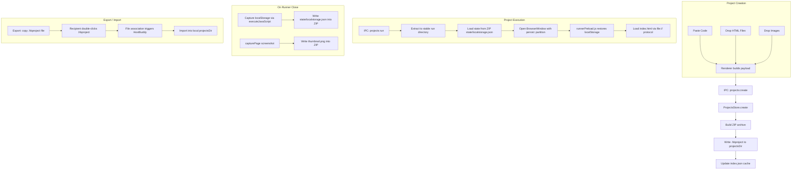
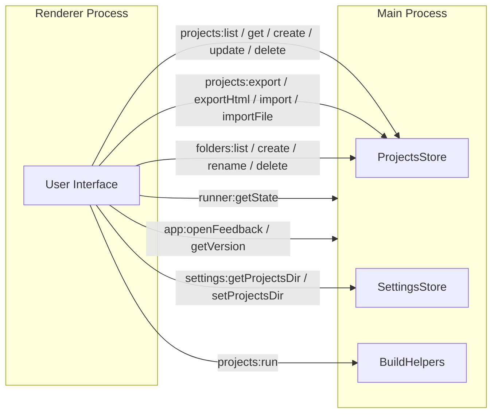
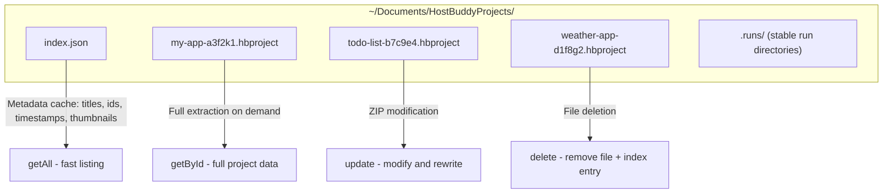
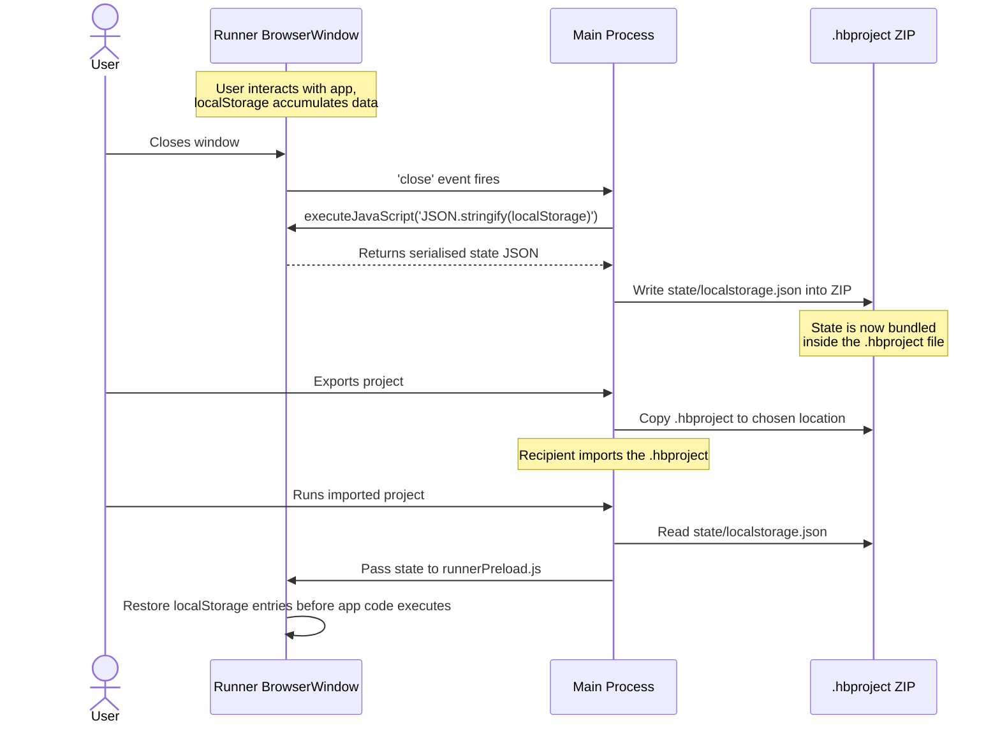

# HostBuddy v1.4.0: Project Storage Overhaul and the Portable .hbproject Format

---

## Executive Summary

HostBuddy v1.4.0 is the most significant architectural release to date. I have completely redesigned how projects are stored, executed, and shared — moving from a monolithic JSON file to individual ZIP-based `.hbproject` bundles, introducing persistent runtime state via Electron session partitions, implementing drag-and-drop multi-file project creation, and adding native file type association so that `.hbproject` files can be double-clicked to open directly in the application.

This release addresses the fundamental limitation of prior versions: projects were ephemeral data entries in a single JSON blob. They could not be easily moved, backed up, or shared with preserved runtime state. With v1.4.0, each project is a self-contained, portable file that encapsulates code, assets, runtime state, and metadata — making HostBuddy projects truly shareable artefacts.

---

## Table of Contents

1. [Problem Statement](#problem-statement)
2. [What Changed in v1.4.0](#what-changed-in-v140)
3. [Technical Architecture](#technical-architecture)
4. [The .hbproject Format](#the-hbproject-format)
5. [Storage and Persistence Layer](#storage-and-persistence-layer)
6. [Runtime Persistence via Session Partitions](#runtime-persistence-via-session-partitions)
7. [Multi-File Project Creation UX](#multi-file-project-creation-ux)
8. [User-Selectable Storage Directory](#user-selectable-storage-directory)
9. [File Type Association and Sharing](#file-type-association-and-sharing)
10. [Auto-Generated Thumbnails](#auto-generated-thumbnails)
11. [Migration from Legacy Format](#migration-from-legacy-format)
12. [Technologies Used](#technologies-used)
13. [Challenges Encountered](#challenges-encountered)
14. [What I Learnt](#what-i-learnt)
15. [Future Considerations](#future-considerations)
16. [Technical Tags](#technical-tags)

---

## Problem Statement

### The Monolithic JSON Limitation

Prior to v1.4.0, every project in HostBuddy was stored inside a single `projects.json` file located in `~/Library/Application Support/HostBuddy/HostBuddy/` (macOS) or `%APPDATA%\HostBuddy\HostBuddy\` (Windows). This file contained an array of project objects, each with their code as a string, image attachments as base64 data URIs, and all metadata.

This design had several critical limitations:

| Problem | Impact |
|---------|--------|
| **Single point of failure** | Corruption of `projects.json` destroyed all projects simultaneously |
| **No portability** | Users could not easily share a single project — they had to export to a JSON wrapper |
| **No runtime persistence** | localStorage and IndexedDB data from running projects was lost between sessions |
| **No user-controlled storage** | The storage location was hardcoded to the Electron `userData` path |
| **Base64 bloat** | Images stored as data URIs inflated the JSON file by approximately 33% |
| **Single-file projects only** | No support for multi-file HTML projects with separate CSS, JavaScript, or image assets referenced by path |

### Design Goals for v1.4.0

I established five goals for this release:

1. **Each project must be a self-contained portable file** — moveable, shareable, and inspectable
2. **Runtime state must persist across sessions** — if an app uses localStorage, that data survives restarts
3. **Users must be able to drop files to create projects** — not just paste code into a textarea
4. **Users must control where their projects live on disk** — a configurable storage directory
5. **Sharing must be native** — double-click a `.hbproject` file and it opens in HostBuddy

---

## What Changed in v1.4.0

### New and Rewritten Files

| File | Action | Purpose |
|------|--------|---------|
| `src/main/settingsStore.js` | **New** | Persists user preferences (storage directory path) |
| `src/main/projectsStore.js` | **Rewritten** | ZIP-based CRUD with `index.json` metadata cache |
| `src/main/buildHelpers.js` | **Extracted** | React scaffold, esbuild bundling, pnpm install, HTML preprocessing |
| `src/main/runnerPreload.js` | **New** | Restores serialised localStorage into runner windows on launch |
| `src/main/ipc.js` | **Rewritten** | All IPC handlers adapted for new store, session partitions, state capture |
| `src/main/main.js` | **Updated** | Settings initialisation, legacy migration, file association handling |
| `src/preload.js` | **Updated** | Exposes `getProject`, settings APIs, file import listener |
| `src/renderer/index.html` | **Updated** | Drop zone, code-input tabs, settings modal, global import overlay |
| `src/renderer/renderer.js` | **Updated** | File list UI, drag-and-drop logic, settings panel, thumbnail display |
| `src/renderer/styles.css` | **Updated** | Drop zone, file list, tab switcher, overlay styles |
| `tests/projectsStore.test.js` | **Rewritten** | 16 tests covering ZIP CRUD, folders, migration, state preservation |
| `tests/settingsStore.test.js` | **New** | 6 tests covering settings persistence and defaults |

### Dependency Changes

- **Added**: `adm-zip` (^0.5.16) — pure JavaScript ZIP read/write library with no native dependencies, chosen specifically for compatibility with Electron's ASAR packaging

---

## Technical Architecture

### High-Level Data Flow

The following diagram illustrates how projects flow through the system in v1.4.0, from creation to export:



### IPC Channel Architecture

The application communicates between renderer and main process via 19 IPC channels:



---

## The .hbproject Format

Each project is stored as a ZIP archive with the `.hbproject` extension. Internally, it follows a well-defined directory structure:

```
my-app.hbproject (ZIP archive)
├── manifest.json            # Project metadata and configuration
├── icon.png                 # Project icon (raw binary, not base64)
├── files/
│   └── index.html           # Main entry file (and any additional HTML files)
├── assets/
│   ├── logo.png             # Referenced images and media
│   └── background.jpg
├── state/
│   └── localstorage.json    # Serialised runtime state
└── thumbnail.png            # Auto-captured preview screenshot
```

### manifest.json Schema

```json
{
  "id": "a1b2c3d4-e5f6-7890-abcd-ef1234567890",
  "title": "My Application",
  "description": "A brief description of the project",
  "version": 1,
  "mainFile": "index.html",
  "offline": false,
  "folderId": null,
  "createdAt": "2026-03-01T12:00:00.000Z",
  "updatedAt": "2026-03-01T14:30:00.000Z"
}
```

### Design Rationale

I chose ZIP as the container format for several reasons:

- **Inspectable**: Users can rename `.hbproject` to `.zip` and inspect contents with any archive tool
- **Binary-efficient**: Images are stored as raw bytes rather than base64 (saving ~33% per asset)
- **Self-contained**: Every artefact the project needs travels within a single file
- **Well-supported**: `adm-zip` provides synchronous read/write in pure JavaScript, requiring no native compilation — critical for Electron ASAR compatibility

---

## Storage and Persistence Layer

### ProjectsStore Architecture

The rewritten `ProjectsStore` class manages a directory of `.hbproject` files alongside a lightweight `index.json` metadata cache:



The `index.json` cache is a performance optimisation only. It can always be rebuilt by scanning all `.hbproject` files in the directory — making the system resilient to manual file operations such as dragging files in or out via Finder or Explorer.

### Key Design Decision: Lazy Full Extraction

The `getAll()` method returns only metadata from the index cache (title, description, icon, timestamps). The full project — including code and attachments — is only extracted from the ZIP when `getById()` is called. This means listing dozens of projects is instantaneous, whilst the ZIP decompression cost is incurred only when a user opens or runs a specific project.

---

## Runtime Persistence via Session Partitions

### The Problem

In prior versions, when a user ran a project that stored data in `localStorage` or `IndexedDB`, that data was lost when the runner window closed. Each run created a fresh, ephemeral environment. For applications like to-do lists, note-taking tools, or games with save states, this made HostBuddy-hosted apps fundamentally less useful than their browser counterparts.

### The Solution: Electron Session Partitions

Each project now runs in an isolated Electron session partition:

```javascript
const runner = new BrowserWindow({
  webPreferences: {
    partition: `persist:project-${id}`,
    preload: runnerPreloadPath,
    // ...
  }
});
```

The `persist:` prefix instructs Electron to durably store the session data (localStorage, IndexedDB, cookies, cache) in `{userData}/Partitions/persist:project-{id}/`. This is an Electron built-in mechanism — no custom serialisation is required for local persistence.

### State Capture for Export

Session partitions solve persistence during local use, but they do not travel with the `.hbproject` file when exported. To make runtime state portable, I implemented a capture-and-restore cycle:



The `runnerPreload.js` script handles the restoration side:

```javascript
async function restoreState() {
  const state = await ipcRenderer.invoke('runner:getState');
  if (state && typeof state === 'object') {
    for (const [key, value] of Object.entries(state)) {
      localStorage.setItem(key, value);
    }
  }
}
restoreState();
```

This ensures that when a recipient imports and runs a shared `.hbproject`, they receive the same data and user experience as the original author.

---

## Multi-File Project Creation UX

### Before v1.4.0

The project creation modal had a single textarea labelled "Paste your code." Users had to copy code from their clipboard and paste it in. Image attachments were handled via a separate file picker in an earlier step. There was no concept of a "main file" — everything was a single code string.

### The New Flow

Stage 2 of the project modal now features a tabbed interface:

- **Drop Files tab**: A large drop zone accepting `.html`, `.css`, `.js`, and image files via drag-and-drop, with a file browser fallback
- **Paste Code tab**: The original textarea workflow, preserved for users who prefer it

When files are dropped, a unified file list appears showing:
- All added files with their sizes
- Radio buttons on HTML files to designate the main entry point
- Remove buttons per file
- An auto-detected main file (preferring `index.html` if present, otherwise the first HTML file)

### How It Works Internally

Files dropped in the renderer are read via `FileReader` as data URLs. The renderer maintains two parallel data structures:

- `projectFiles[]` — every dropped file with its filename, MIME type, data URI, and an `isHtml` flag
- `projectAttachments[]` — non-main, non-HTML files destined for the `assets/` directory in the ZIP

When the user selects a main file and saves, the main file's content is decoded from its data URI and placed into the `code` field. All other files become attachments. The `projects:create` IPC handler passes these to `ProjectsStore.create()`, which builds the ZIP with `files/index.html` and `assets/*`.

---

## User-Selectable Storage Directory

### Default Location

Projects are now stored in `~/Documents/HostBuddyProjects/` by default — a deliberate choice to make them discoverable. The previous location inside `Application Support` (macOS) or `%APPDATA%` (Windows) was effectively hidden from most users.

### Settings Persistence

The `SettingsStore` class persists a small `hostbuddy-settings.json` file in the fixed Electron `userData` path. This file never moves — it always lives at the same location regardless of where the projects directory is configured to be.

### Settings UI

A new Settings modal (accessible from the header) displays the current projects directory path and provides a "Change" button that opens a native directory picker via `dialog.showOpenDialog({ properties: ['openDirectory', 'createDirectory'] })`.

---

## File Type Association and Sharing

### Native File Association

The `package.json` electron-builder configuration now registers the `.hbproject` extension:

```json
"fileAssociations": [
  {
    "ext": "hbproject",
    "name": "HostBuddy Project",
    "description": "HostBuddy Project File",
    "mimeType": "application/x-hbproject",
    "role": "Editor"
  }
]
```

On macOS, this is handled via the `open-file` application event. On Windows and Linux, the file path arrives via `process.argv`. Both pathways trigger the same import flow: read the manifest from the ZIP, show a confirmation dialogue, and copy the file into the user's projects directory.

### Global Drag-to-Import

The main window now accepts `.hbproject` files dropped anywhere on its surface — not just inside the creation modal. A full-window overlay appears with visual feedback ("Drop .hbproject to import"), and the import flow triggers automatically.

### Export as Standalone HTML

In addition to the `.hbproject` export, users can now right-click the export button to produce a single self-contained `.html` file with all assets inlined as data URIs. This is useful for sharing with recipients who do not have HostBuddy installed.

---

## Auto-Generated Thumbnails

After a project is successfully loaded in a runner window, HostBuddy captures a screenshot via `runner.webContents.capturePage()`, resizes it to 400 pixels wide, and writes it into the `.hbproject` ZIP as `thumbnail.png`. The thumbnail is also cached as a base64 string in `index.json` for fast rendering on project cards.

This replaces the static default icon on the project card with a live visual preview of the actual application, making it significantly easier to identify projects at a glance.

---

## Migration from Legacy Format

### Automatic Upgrade

On first launch after updating to v1.4.0, the application detects the presence of the legacy `projects.json` file and automatically converts each project into an individual `.hbproject` ZIP file. The migration preserves:

- Project ID (ensuring no duplicate creation)
- Title, description, and all metadata
- Code content (written to `files/index.html`)
- Icon (extracted from base64 and stored as raw binary)
- Attachments (extracted from data URIs and stored in `assets/`)
- Folder assignments and timestamps

After successful migration, the legacy file is renamed to `projects.json.migrated` as a safety backup.

### Backward-Compatible Import

The import handler detects the format of incoming files:
- `.hbproject` files are treated as ZIP archives
- `.hbproj` and `.json` files are parsed as legacy JSON (supporting the old export format, arrays of projects, and single project objects)

This ensures that projects exported from older versions of HostBuddy can still be imported into v1.4.0 without any manual conversion.

---

## Technologies Used

| Technology | Version | Purpose |
|------------|---------|---------|
| **Electron** | ^30.0.0 | Cross-platform desktop shell, BrowserWindow, session partitions |
| **adm-zip** | ^0.5.16 | ZIP archive read/write (pure JS, ASAR-compatible) |
| **esbuild** | ^0.21.5 | React/TypeScript bundling at runtime |
| **pnpm** | ^9.4.0 (bundled) | Dependency installation for React projects |
| **@twind/core + preset-tailwind** | ^1.1.3 | Runtime Tailwind CSS for React projects |
| **Vanilla JavaScript** | ES2020+ | Renderer UI, state management, drop zone logic |
| **CSS3** | Modern | Custom properties, flexbox, transitions, animations |
| **electron-builder** | ^24.13.3 | Multi-platform distribution (DMG, NSIS, ZIP) |
| **Jest** | ^29.7.0 | Unit testing for store layers |
| **Node.js** | 18+ | Main process runtime |

---

## Challenges Encountered

### 1. Preserving State During ZIP Updates

**Challenge**: When a project is updated (e.g., the user edits the code), the entire ZIP is rebuilt. But the `state/localstorage.json` and `thumbnail.png` from the previous version must not be lost.

**Solution**: Before writing the new ZIP, I open the old ZIP and copy forward any entries under `state/` and the `thumbnail.png` file:

```javascript
try {
  const old = new AdmZip(fp);
  for (const e of old.getEntries()) {
    if ((e.entryName.startsWith('state/') || e.entryName === 'thumbnail.png') && !e.isDirectory) {
      zip.addFile(e.entryName, e.getData());
    }
  }
} catch (_) {}
```

This was a subtle requirement that only became apparent during integration testing — an update that wiped runtime state would have been a significant regression.

### 2. Session Partition Isolation vs State Export

**Challenge**: Electron's `persist:` partitions provide automatic localStorage persistence for local use. But when exporting, I needed to extract that state from inside the partition and write it into the ZIP — two entirely different persistence mechanisms that needed to be synchronised.

**Solution**: On runner window close, I use `webContents.executeJavaScript('JSON.stringify(localStorage)')` to serialise the partition's localStorage into a JSON string, then write it into the ZIP. On import and first run, the `runnerPreload.js` script restores from the ZIP's `state/localstorage.json` into the new partition before the application code executes. This creates a clean handoff between the two persistence layers.

### 3. Decoupling getAll from Full ZIP Extraction

**Challenge**: The previous `getAll()` returned complete project objects including code. With ZIP-based storage, extracting every ZIP just to render the project list would have been unacceptably slow.

**Solution**: I introduced the `index.json` metadata cache — a lightweight file that stores just the listing data (titles, IDs, timestamps, thumbnails). The `getAll()` method reads only from this cache. Full ZIP extraction happens lazily via `getById()` when a specific project is opened or run. The cache is automatically rebuilt if it becomes corrupted or missing.

### 4. Drop Zone and Textarea Coexistence

**Challenge**: The new drop zone for files and the existing paste-code textarea serve different user workflows but produce the same output (a project with code). They needed to coexist without confusing the user about which input takes precedence.

**Solution**: I implemented a tabbed interface within Stage 2 — "Drop Files" and "Paste Code" — making it visually clear that these are alternative input methods. When files are dropped, the main file's content is automatically synchronised into the textarea, so the user can switch tabs and see (or edit) the extracted code. This ensures the code textarea remains the single source of truth at save time.

### 5. Cross-Platform File Association

**Challenge**: macOS and Windows handle file type association through completely different mechanisms. macOS uses the `open-file` application event (which fires even when the app is already running), whilst Windows passes the file path via `process.argv` on launch.

**Solution**: I implemented both pathways in `main.js`. The macOS handler responds to `app.on('open-file')` and forwards to a shared `handleFileOpen()` function. The Windows handler scans `process.argv` for `.hbproject` paths after the app is ready. Both converge on the same import confirmation dialogue and file copy logic.

---

## What I Learnt

### 1. File Formats Are User Experience Decisions

**Insight**: Choosing ZIP as the container format was not just a technical decision — it fundamentally changed how users perceive their projects. A `.hbproject` file on the desktop feels tangible in a way that a row in a hidden JSON file never could.

**Takeaway**: When designing local-first applications, the file format is a first-class UX concern. Users should be able to see, move, copy, and share their data using the tools they already know (Finder, Explorer, email, cloud storage).

### 2. Two Persistence Layers Are Better Than One

**Insight**: Using Electron session partitions for runtime persistence and ZIP-embedded state for portability gave me the best of both worlds — zero-configuration local persistence and full-fidelity export.

**Takeaway**: Do not try to solve local persistence and portable export with the same mechanism. They have different performance characteristics, different lifecycle requirements, and different failure modes. Let each do what it does best.

### 3. Metadata Caches Must Be Rebuildable

**Insight**: By designing `index.json` as a disposable cache that can always be rebuilt from the `.hbproject` files on disk, I made the system resilient to corruption, manual file manipulation, and edge cases I had not anticipated.

**Takeaway**: Any metadata index should be treated as a cache, not a source of truth. The source of truth should be the primary data files themselves. This principle eliminated an entire class of synchronisation bugs.

### 4. Migration Must Be Invisible

**Insight**: The automatic migration from `projects.json` to `.hbproject` files runs silently on first launch. Users should never have to think about format upgrades — their projects should simply be there.

**Takeaway**: Data migration in desktop applications must be automatic, non-destructive (keep the old data as a backup), and idempotent (running it twice should not create duplicates). I achieved all three by checking for existing IDs during migration and renaming the legacy file only after success.

### 5. adm-zip Is Remarkably Capable for Electron

**Insight**: I initially considered `archiver` and `yazl`/`yauzl` for ZIP operations, but `adm-zip` was the only library that provided synchronous read/write, worked inside Electron's ASAR archive, had zero native dependencies, and supported both creating new archives and modifying existing ones. It handled every use case cleanly.

**Takeaway**: For Electron applications, native dependency count matters enormously. Every native module complicates cross-compilation, ASAR unpacking, and platform-specific builds. Pure JavaScript solutions, even if slightly less performant, are strongly preferred.

---

## Future Considerations

### 1. IndexedDB State Export

**Complexity**: High
**Impact**: Full state portability for complex applications

Currently, only `localStorage` is captured and restored during export/import. Applications using IndexedDB (common in more sophisticated AI-generated apps) would lose their data on transfer. A future enhancement could serialise IndexedDB databases into the `state/` directory, though this requires navigating the asynchronous, transactional nature of the IndexedDB API.

### 2. Project Version History

**Complexity**: Medium
**Impact**: Safety net for iterative development

Each save could preserve the previous version within a `history/` directory inside the ZIP, enabling users to roll back to earlier versions without external version control. Even retaining the last three versions would provide meaningful protection against accidental code loss.

### 3. Live Preview on Project Cards

**Complexity**: Medium
**Impact**: Enhanced visual project identification

Building on the auto-thumbnail foundation, a future version could render a live miniature preview of the project directly on the card, refreshing periodically. This would require offscreen `BrowserWindow` rendering, which Electron supports but which carries performance implications.

### 4. Collaborative Sharing via URL

**Complexity**: High
**Impact**: Frictionless project distribution

A cloud-hosted relay service could allow users to generate a shareable URL for a `.hbproject` file, enabling one-click import without manual file transfer. This would require server infrastructure and careful consideration of privacy, storage limits, and content moderation.

---

## Conclusion

HostBuddy v1.4.0 transforms the application from a code runner into a project management environment. The `.hbproject` format gives users ownership of their creations in a way that a hidden JSON database never could — they can see their projects as files, organise them in folders of their choosing, back them up to cloud storage, email them to colleagues, and double-click to open them.

The technical implementation spans a complete rewrite of the storage layer, a new persistence architecture combining Electron session partitions with ZIP-embedded state snapshots, a redesigned creation UX with drag-and-drop support, and native OS integration via file type association. The migration path from v1.3.0 is fully automatic and non-destructive.

This release involved approximately 2,400 lines of new or rewritten code across 12 files, with 21 passing unit tests covering the storage, settings, and migration layers. One new dependency was added (`adm-zip`), and the existing `ipc.js` was refactored into two focused modules (`ipc.js` and `buildHelpers.js`) to maintain the codebase's adherence to a sub-300-line-per-file target.

The result is a more robust, more portable, and more user-friendly HostBuddy — one where the projects feel like they truly belong to the user.

---

## Technical Tags

`#Electron` `#JavaScript` `#ZIP` `#adm-zip` `#FileFormat` `#LocalFirst` `#DesktopApp` `#SessionPartitions` `#RuntimePersistence` `#DragAndDrop` `#FileAssociation` `#CrossPlatform` `#macOS` `#Windows` `#electron-builder` `#DataMigration` `#ProjectPortability` `#esbuild` `#React` `#pnpm` `#Twind` `#TailwindCSS` `#IPC` `#ContextIsolation` `#Sandbox` `#UXDesign` `#OfflineFirst`

---

## Version Information

- **Previous Version**: v1.3.0
- **Current Version**: v1.4.0
- **Release Date**: March 2026
- **New Dependencies**: `adm-zip` (^0.5.16)
- **Files Changed**: 12
- **Tests**: 21 passing (3 test suites)
- **Estimated Lines Changed**: ~2,400 new/rewritten

