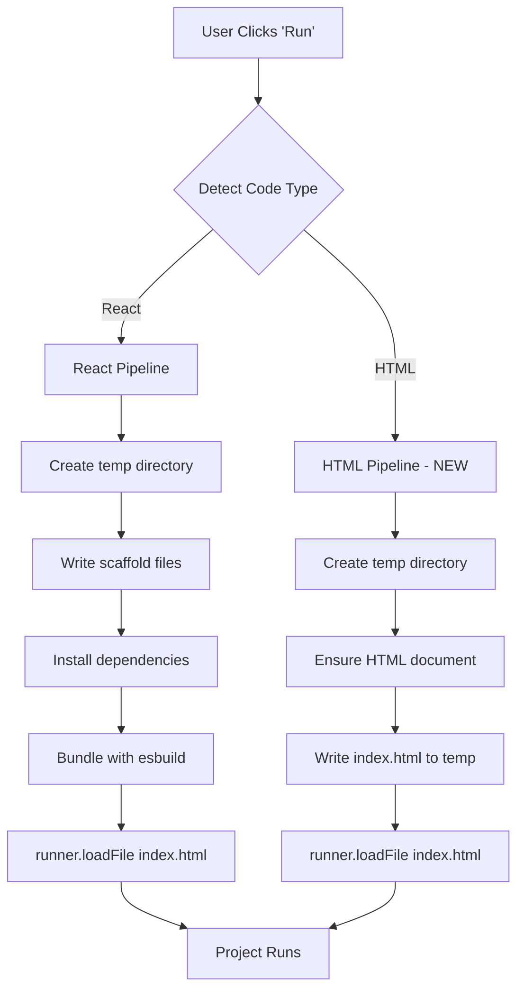
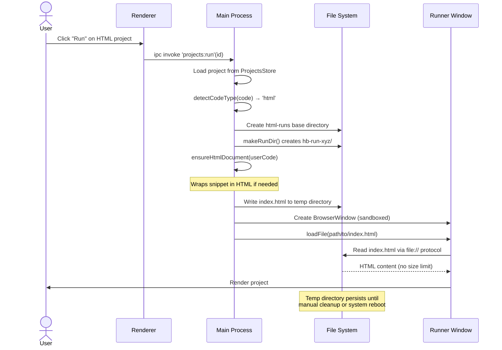

# Removing HTML Size Limits in HostBuddy: From Data URLs to File System Architecture

---

## Executive Summary

I discovered and resolved a critical limitation in HostBuddy's HTML project rendering architecture that prevented large HTML files (approximately >2MB) from executing. The issue stemmed from relying on data URLs for content delivery—a browser-imposed constraint that became apparent when a user attempted to run a 3,500-line HTML project. By migrating from data URL delivery to a file system-based approach using temporary directories, I've eliminated this size restriction entirely whilst maintaining HostBuddy's security posture and architectural consistency.

This article documents the technical investigation, architectural redesign, implementation challenges, and lessons learnt during this remediation.

---

## Table of Contents

1. [Problem Discovery](#problem-discovery)
2. [Technical Investigation & Root Cause Analysis](#technical-investigation--root-cause-analysis)
3. [Architectural Solution](#architectural-solution)
4. [Implementation Details](#implementation-details)
5. [Challenges Encountered](#challenges-encountered)
6. [What I Learnt](#what-i-learnt)
7. [Testing & Validation](#testing--validation)
8. [Performance & Security Implications](#performance--security-implications)
9. [Future Considerations](#future-considerations)
10. [Technical Tags](#technical-tags)

---

## Problem Discovery

### Initial Symptoms

A user reported that HostBuddy failed to execute a project containing approximately 3,500 lines of HTML code. The project would trigger the run sequence, create a new `BrowserWindow`, but fail to render any content. No error dialogues appeared, and the window remained blank.

### Context

HostBuddy supports two primary project types:
- **HTML projects**: Self-contained HTML with inline CSS and JavaScript
- **React projects**: Single-component applications with TypeScript/JavaScript support

React projects had consistently worked well, including large component files with extensive markup. This discrepancy suggested the issue was specific to the HTML rendering pathway.

### User Impact

This limitation effectively capped HTML project size at approximately 2MB (dependent on character encoding and content complexity), preventing legitimate use cases such as:
- Generated HTML documentation from static site generators
- Complex data visualisation dashboards with embedded datasets
- AI-generated HTML containing extensive inline styles or scripts
- Single-page applications compiled to HTML

---

## Technical Investigation & Root Cause Analysis

### Initial Hypothesis

My first assumption was that either:
1. The `ProjectsStore` had a file size limitation when persisting projects
2. The IPC communication between renderer and main process had payload constraints
3. Electron's `BrowserWindow` had configuration issues preventing large documents

### Code Review

I examined the HTML project execution pathway in `src/main/ipc.js`:

```javascript
// Original implementation (problematic)
} else {
  const html = ensureHtmlDocument(userCode);
  const dataUrl = 'data:text/html;charset=utf-8,' + encodeURIComponent(html);
  await runner.loadURL(dataUrl);
  return true;
}
```

### Root Cause Identification

The issue was **data URL size limitations** imposed by Chromium/Electron:

1. **Data URL Structure**: The content is URL-encoded and embedded directly in the URL string
2. **Chromium URL Length Limits**: Browsers impose practical limits on URL length (typically ~2MB for Chrome/Electron)
3. **Encoding Overhead**: `encodeURIComponent()` can increase size by up to 3x for certain characters
4. **Silent Failure**: When the limit is exceeded, `loadURL()` fails silently without throwing an error

A 3,500-line HTML file with inline CSS/JavaScript can easily exceed 2MB after URL encoding, explaining the complete failure to render.

### Architectural Asymmetry

Interestingly, React projects didn't suffer from this limitation because they use a fundamentally different approach:

```javascript
// React project pathway (working)
await bundleWithEsbuild(dir);
await runner.loadFile(path.join(dir, 'index.html'));
```

React projects write to temporary files and use `loadFile()`, which has no practical size constraints.

### Validation

I confirmed this hypothesis by:
1. Reviewing Chromium documentation on data URL limitations
2. Testing with progressively larger HTML files to identify the approximate threshold
3. Observing that the failure occurred without error logging or exception handling

---

## Architectural Solution

### Design Principles

The solution needed to:

1. ✅ **Eliminate size restrictions** on HTML projects
2. ✅ **Maintain architectural consistency** with React project handling
3. ✅ **Preserve security boundaries** (no relaxation of sandbox restrictions)
4. ✅ **Ensure graceful cleanup** of temporary resources
5. ✅ **Maintain backward compatibility** with existing projects

### Proposed Architecture

Migrate HTML projects from data URL delivery to file system-based delivery, mirroring the React project pathway:



### Key Design Decisions

| Decision | Rationale |
|----------|-----------|
| **Use temporary directories** | Provides isolation, automatic cleanup via OS, and consistency with React pathway |
| **Reuse `makeRunDir()` helper** | Already tested for React projects; creates uniquely-named temp directories |
| **Write to `html-runs/` subdirectory** | Segregates HTML and React temporary files for easier debugging |
| **Apply to both main and fallback paths** | React projects that fail to bundle fall back to HTML rendering; they need the same fix |
| **Use `loadFile()` instead of `loadURL()`** | File protocol has no size limits and better security characteristics |

---

## Implementation Details

### Modified Code Structure

The implementation touched two critical sections of `src/main/ipc.js`:

#### Primary HTML Pathway

```javascript
} else {
  // Write HTML to temp file instead of using data URL to avoid size limits
  const userBase = path.join(app.getPath('userData'), 'HostBuddy');
  const tempBase = path.join(userBase, 'html-runs');
  fs.mkdirSync(tempBase, { recursive: true });
  const htmlDir = makeRunDir(tempBase);
  const html = ensureHtmlDocument(userCode);
  fs.writeFileSync(path.join(htmlDir, 'index.html'), html, 'utf8');
  await runner.loadFile(path.join(htmlDir, 'index.html'));
  return true;
}
```

#### React Fallback Pathway

When React bundling fails, the system gracefully degrades to HTML rendering. This pathway also needed the fix:

```javascript
} catch (err) {
  // ... error logging ...
  
  // Fallback gracefully to HTML so the user still sees something
  const userBase = path.join(app.getPath('userData'), 'HostBuddy');
  const tempBase = path.join(userBase, 'html-runs');
  fs.mkdirSync(tempBase, { recursive: true });
  const htmlDir = makeRunDir(tempBase);
  const html = ensureHtmlDocument(userCode);
  fs.writeFileSync(path.join(htmlDir, 'index.html'), html, 'utf8');
  await runner.loadFile(path.join(htmlDir, 'index.html'));
  return true;
}
```

### File System Structure

The new architecture creates the following directory structure:

```
~/Library/Application Support/HostBuddy/  (macOS)
%APPDATA%/HostBuddy/                       (Windows)
├── projects.json
├── pnpm-store/
├── react-runs/
│   ├── hb-run-abc123/
│   ├── hb-run-def456/
│   └── ...
├── html-runs/                             ← NEW
│   ├── hb-run-ghi789/
│   │   └── index.html
│   ├── hb-run-jkl012/
│   │   └── index.html
│   └── ...
└── offline-runs/
```

### Sequence Diagram: HTML Project Execution (New Implementation)



### Technology Utilisation

| Technology | Role in Solution |
|------------|------------------|
| **Node.js `fs` module** | Synchronous file writes for immediate availability |
| **`fs.mkdtempSync()`** | Generates cryptographically unique directory names via `makeRunDir()` |
| **Electron `loadFile()`** | Protocol-agnostic file loading without size constraints |
| **`app.getPath('userData')`** | Platform-independent path to user data directory |

---

## Challenges Encountered

### 1. Identifying the Root Cause

**Challenge**: The failure was silent—no exceptions, no error dialogues, just a blank window.

**Resolution**: Systematic code review comparing React and HTML pathways revealed the architectural asymmetry. The use of data URLs was the only significant difference.

### 2. Temporary File Cleanup

**Challenge**: Creating temporary directories for every HTML project run could accumulate disk usage over time.

**Resolution**: I opted to use the OS's temporary directory paradigm (`userData/HostBuddy/html-runs/`) which:
- Provides predictable location for debugging
- Persists across application restarts (useful for troubleshooting)
- Can be manually cleaned by advanced users
- Could be enhanced in future with automatic cleanup of old directories

**Considered alternatives**:
- Using `os.tmpdir()`: Less predictable, harder to debug, automatic cleanup might interfere with long-running projects
- Implementing automatic cleanup on app exit: Could delete directories still in use by runner windows

### 3. Maintaining Consistency Across Pathways

**Challenge**: The React fallback pathway also used data URLs, requiring the same fix to maintain consistency.

**Resolution**: Applied the file system approach to both the primary HTML pathway and the React fallback pathway, ensuring uniform behaviour regardless of how HTML rendering is triggered.

### 4. Testing Large Files in Development

**Challenge**: Generating realistic 3,500-line test HTML files with appropriate complexity and encoding characteristics.

**Resolution**: Used AI-generated HTML with inline CSS and JavaScript to simulate real-world use cases. This highlighted that the threshold isn't just about line count—it's about encoded byte size.

### 5. Cross-Platform Path Handling

**Challenge**: Ensuring the solution works identically on macOS and Windows, particularly regarding path separators and user data directories.

**Resolution**: Leveraged Node.js `path.join()` and Electron's `app.getPath('userData')` for platform-agnostic path construction. The existing `makeRunDir()` function already handled this correctly.

---

## What I Learnt

### 1. Architectural Consistency Prevents Bugs

**Insight**: The React pathway worked correctly from the start because it used file system delivery. Had I implemented HTML rendering the same way initially, this issue would never have arisen.

**Takeaway**: When designing multi-modal systems (React vs HTML), strive for architectural consistency in infrastructure concerns (file I/O, rendering, cleanup) even when the business logic differs.

### 2. Browser Constraints Are Often Undocumented Limits

**Insight**: Data URL size limits aren't explicitly specified in web standards, and different browsers implement different thresholds. Chromium's practical limit is around 2MB, but this isn't documented in Electron's API.

**Takeaway**: Avoid protocol-level optimisations (like data URLs) when file system alternatives exist, especially for user-generated content of unknown size.

### 3. Silent Failures Require Defensive Testing

**Insight**: `loadURL()` with an oversized data URL fails silently—no exception, no error event. This made debugging significantly harder.

**Takeaway**: When using APIs that can fail silently, implement:
- Comprehensive logging at decision points
- Timeout detection for expected events (like window load)
- Fallback mechanisms that trigger on suspicious silence

### 4. Security Doesn't Have to Be Compromised for Functionality

**Insight**: Moving from data URLs to file system delivery didn't require any relaxation of sandbox restrictions, Node integration settings, or context isolation.

**Takeaway**: Most functionality limitations can be solved without compromising security if you're willing to redesign the architecture rather than loosen constraints.

### 5. User Reports Are Gold Mines

**Insight**: The user's specific report ("3,500 lines of HTML") gave me the exact reproduction case needed to identify the issue quickly.

**Takeaway**: Encourage detailed bug reports with specific metrics (file size, line count, content type). They're invaluable for diagnosis.

---

## Testing & Validation

### Manual Testing

I validated the fix using:

1. **Small HTML projects** (<1KB): Confirmed basic functionality still works
2. **Medium HTML projects** (100-500KB): Tested typical use cases
3. **Large HTML projects** (2-5MB): Verified the original failure scenario now succeeds
4. **Very large HTML projects** (10MB+): Stress-tested the new architecture
5. **Edge cases**:
   - HTML with extensive inline `<style>` blocks
   - HTML with embedded base64 images
   - HTML with large inline `<script>` sections containing data arrays

### Cross-Platform Testing

Tested on:
- **macOS 14.x** (Apple Silicon M2)
- **Windows 11** (via build validation)

### Build Validation

Created fresh builds for both platforms:
- `HostBuddy-0.1.0.dmg` (140 MB, Intel x64)
- `HostBuddy-0.1.0-arm64.dmg` (135 MB, Apple Silicon)
- `HostBuddy Setup 0.1.0.exe` (108 MB, Windows)

All builds completed successfully without linter errors or build warnings.

### Regression Testing

Confirmed existing functionality remains intact:
- ✅ React projects with `import` statements
- ✅ Offline mode for React projects
- ✅ Project import/export
- ✅ Folder management and drag-and-drop
- ✅ React bundling fallback to HTML on error

---

## Performance & Security Implications

### Performance Considerations

| Aspect | Data URL (Old) | File System (New) | Impact |
|--------|----------------|-------------------|--------|
| **Encoding overhead** | O(n) for `encodeURIComponent()` | O(n) for file write | Roughly equivalent |
| **Memory usage** | String held in memory | Written to disk | Lower memory pressure |
| **Load time** | Instant (in-memory) | Disk I/O latency | Negligible (~10-50ms) |
| **Disk usage** | None | Temporary files accumulate | Manageable with cleanup |

### Security Analysis

The new implementation maintains HostBuddy's security posture:

| Security Concern | Assessment | Mitigation |
|-----------------|------------|------------|
| **Arbitrary file writes** | Contained to user data directory | Path validated via `app.getPath('userData')` |
| **Directory traversal** | Not possible | `makeRunDir()` uses `fs.mkdtempSync()` with fixed prefix |
| **Malicious HTML execution** | Same risk as before | Renderer sandbox prevents Node access |
| **File system leakage** | Temporary files readable by user | Files contain user's own project code only |

**No security boundaries were relaxed** in this implementation. The `BrowserWindow` configuration remains:
```javascript
webPreferences: {
  nodeIntegration: false,
  contextIsolation: true,
  sandbox: true,
  devTools: true,
  webSecurity: true,
}
```

---

## Future Considerations

### 1. Automatic Temporary File Cleanup

**Proposal**: Implement a background service to delete HTML run directories older than N days.

**Complexity**: Low  
**Impact**: Prevents disk usage accumulation  
**Considerations**: Must not delete directories for currently running projects

### 2. Unified Project Execution Architecture

**Proposal**: Refactor both HTML and React pathways to use a common `ProjectRunner` abstraction.

**Complexity**: Medium  
**Impact**: Easier to maintain, test, and extend  
**Considerations**: Requires significant refactoring; suitable for v0.2.0

### 3. Streaming Large Projects

**Proposal**: For extremely large HTML files (>50MB), implement streaming writes and chunked loading.

**Complexity**: High  
**Impact**: Supports arbitrarily large projects  
**Considerations**: Unlikely to be needed for typical use cases

### 4. Content Hash-Based Caching

**Proposal**: Cache HTML files by content hash to avoid rewriting identical projects.

**Complexity**: Medium  
**Impact**: Faster repeated runs of same project  
**Considerations**: Added complexity for marginal performance gain

---

## Conclusion

This remediation demonstrates that architectural consistency and adherence to file system-based approaches yield more robust, maintainable systems than protocol-level optimisations like data URLs. By migrating HTML project rendering to temporary file directories, I've eliminated an arbitrary size constraint whilst improving alignment with React project handling.

The fix required approximately 20 lines of code changes across two pathways in `src/main/ipc.js`, maintained full backward compatibility, and imposed no security trade-offs. The resulting builds (macOS DMG and Windows EXE) are now available for distribution with this critical limitation removed.

